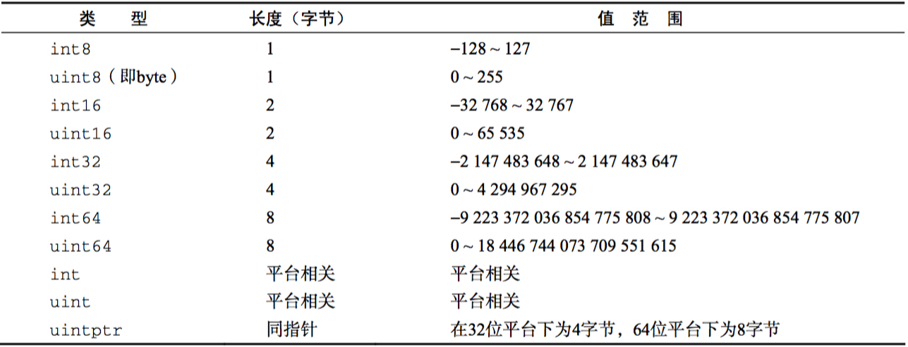
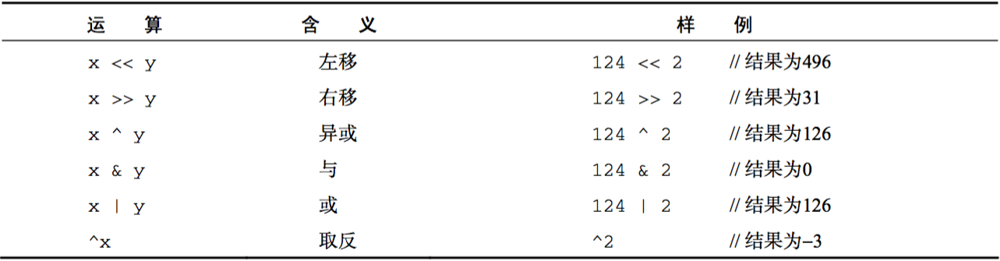

# GO 语言编程

> 作者：March    
> 链接：[GO 语言编程](https://github.com/maoqiqi/blog/blob/master/pages/go/go.md)    
> 博客：http://blog.csdn.net/u011810138    
> 邮箱：fengqi.mao.march@gmail.com    
> 著作权归作者所有。商业转载请联系作者获得授权，非商业转载请注明出处。    

## 目录

* [初识Go语言](#初识Go语言)
  * [语言简史](#语言简史)
  * [语言特性](#语言特性)
  * [第一个Go程序](#第一个Go程序)
* [顺序编程](#顺序编程)
  * [变量](#变量)
  * [常量](#常量)
  * [类型](#类型)
  * [流程控制](#流程控制)
  * [函数](#函数)
* [面向对象编程](#面向对象编程)
  * [类型系统](#类型系统)
  * [初始化](#初始化)
  * [匿名组合](#匿名组合)
  * [初始化](#初始化)
  * [接口](#接口)
* [并发编程](#并发编程)
  * [并发基础](#并发基础)
  * [协程](#协程)
  * [goroutine](#goroutine)
  * [并发通信](#并发通信)
  * [channel](#channel)
  * [多核并行化](#多核并行化)
* [网络编程](#网络编程)
  

## 初识Go语言

### 语言简史

### 语言特性

Go语言作为一门全新的静态类型开发语言,与当前的开发语言相比具备众多令人兴奋不已的新特性。

* 自动垃圾回收
* 更丰富的内置类型
* 函数多返回值
  
  目前的主流语言中除Python外基本都不支持函数的多返回值功能,不是没有这类需求,可能是语言设计者没有想好该如何提供这个功能,
  或者认为这个功能会影响语言的美感。
* 错误处理
* 匿名函数和闭包
  
  在Go语言中,所有的函数也是值类型,可以作为参数传递。Go语言支持常规的匿名函数和闭包。
* 类型和接口
  
  Go语言的类型定义非常接近于C语言中的结构(struct),甚至直接沿用了struct关键字。
  Go语言也不是简单的对面向对象开发语言做减法,它还引入了一个无比强大的“非侵入式” 接口的概念,
  让开发者从以往对C++和Java开发中的接口管理问题中解脱出来。
* 并发编程
  
  Go语言引入了goroutine概念,它使得并发编程变得非常简单。通过使用goroutine而不是裸用操作系统的并发机制,
  以及使用消息传递来共享内存而不是使用共享内存来通信,Go语言让并发编程变得更加轻盈和安全。
  
  ```
  func sum(values [] int, resultChan chan int) {
  	sum := 0
  	for _, value := range values {
  		sum += value
  	}
  	// 将计算结果发送到channel中
  	resultChan <- sum
  }
  func main() {
  	values := [] int{1, 2, 3, 4, 5, 6, 7, 8, 9, 10}
  	resultChan := make(chan int, 2)
  	go sum(values[:len(values)/2], resultChan)
  	go sum(values[len(values)/2:], resultChan)
  	// 接收结果
  	sum1, sum2 := <-resultChan, <-resultChan
  	fmt.Println("Result:", sum1, sum2, sum1+sum2)
  }
  ```
* 反射
  
  反射(reflection)是在Java语言出现后迅速流行起来的一种概念。通过反射,你可以获取对象类型的详细信息,并可动态操作对象。
  反射是把双刃剑,功能强大但代码可读性并不理想。若非必要,我们并不推荐使用反射。
  射最常见的使用场景是做对象的序列化(serialization,有时候也叫Marshal & Unmarshal)。
* 语言交互性

### 第一个Go程序

```
package main

import "fmt" // 我们需要使用fmt包中的Println()函数

func main() {
	fmt.Println("Hello, world. 你好,世界!")
}
```


## 顺序编程

### 变量

1.变量声明

```
var v1 int             // int(默认为0)
var v2 string          // 字符串(默认为空字符串)
var v3 [10]int         // 数组(元素全部为0的数组)
var v4 []int           // 数组切片(必须要初始化)
var v5 struct {
    a int
    b struct {
        c int
    }
}                      // 结构体(默认值{0 {0}})
var v6 *int            // 指针(默认为nil)
var v7 map[string]int  // map(没有初始化可以取值,不能赋值)
var v8 func(a int) int // 函数(默认为nil)
```

2.变量赋值

```
v1 = 10
v2 = "hello"
v3[0] = 3
v4 = make([]int, 5)
v4[0] = 4
v6 = &v1
v7 = make(map[string]int)
v7["key"] = 10

```

Go语言的变量赋值与多数语言一致,但Go语言中提供了C/C++程序员期盼多年的多重赋值功能,比如下面这个交换i和j变量的语句:

```
i, j = j, i
```

在不支持多重赋值的语言中,交互两个变量的内容需要引入一个中间变量:

```
t = i; i = j; j = t;
```

3.变量初始化

```
var var1 int = 10 // 正确的使用方式1
var var2 = 11     // 正确的使用方式2,编译器可以自动推导出var2的类型
var3 := 12        // 正确的使用方式3,编译器可以自动推导出var3的类型
fmt.Println(var1, var2, var3)
```

4.匿名变量

我们在使用传统的强类型语言编程时,经常会出现这种情况,即在调用函数时为了获取一个值,却因为该函数返回多个值而不得不定义一堆没用的变量。
在Go中这种情况可以通过结合使用多重返回和匿名变量来避免这种丑陋的写法,让代码看起来更加优雅。

假设GetName()函数的定义如下,它返回3个值,分别为firstName、lastName和 nickName:

```
func GetName() (firstName, lastName, nickName string) {
	return "May", "Chan", "Chibi Maruko"
}
```

若只想获得nickName,则函数调用语句可以用如下方式编写:

```
_, _, nickName := GetName()
```

### 常量

在Go语言中,常量是编译期间就已知且不可改变的值。常量可以是数值类型(包括整型、浮点型和复数类型)、布、布尔类型、字符串类型等。

1.字面常量

所谓字面常量(literal),是指程序中硬编码的常量。

2.常量定义

通过const关键字,你可以给字面常量指定一个友好的名字:

```
const Pi float64 = 3.14159265358979323846
const zero = 0.0 // 无类型浮点常量
const (
    size int64 = 1024
    eof        = -1 // 无类型整形常量
)
const u, v float64 = 0, 3   // u = 0.0,v = 3.0 常量的多重赋值
const a, b, c = 3, 4, "foo" // 无类型整形和字符创常量
```

Go的常量定义可以限定常量类型,但不是必需的。如果定义常量时没有指定类型,那么它与字面常量一样,是无类型常量。

常量定义的右值也可以是一个在编译期运算的常量表达式,比如

```
const mask = 1 << 3
```

由于常量的赋值是一个编译期行为,所以右值不能出现任何需要运行期才能得出结果的表达式,比如试图以如下方式定义常量就会导致编译错误:

```
const Home = os.GetEnv("HOME")
```

原因很简单,os.GetEnv()只有在运行期才能知道返回结果,在编译期并不能确定,所以无法作为常量定义的右值。

3.预定义常量

Go语言预定义了这些常量:true、false和iota。

iota比较特殊,可以被认为是一个可被编译器修改的常量,在每一个const关键字出现时被重置为0,然后在下一个const出现之前,
每出现一次iota,其所代表的数字会自动增1。例如：

```
const (
    c0 = iota
    c1
    c2
)

const (
    a = 1 << iota
    b
    c
)

const (
    u         = iota * 42
    v float64 = iota * 42
    w         = iota * 42
)

const x = iota
const y = iota

// 0 1 2 1 2 4 0 42 84 0 0
fmt.Println(c0, c1, c2, a, b, c, u, v, w, x, y)
```

4.枚举

枚举指一系列相关的常量,比如下面关于一个星期中每天的定义。

```
const (
    Sunday       = iota
    Monday
    Tuesday
    Wednesday
    Thursday
    Friday
    Saturday
    numberOfDays  // 这个常量没有导出
)
```

同Go语言的其他符号(symbol)一样,以大写字母开头的常量在包外可见。以上例子中numberOfDays为包内私有,其他符号则可被其他包访问。

### 类型

Go语言内置以下这些基础类型:
* 布尔类型:bool
  
  Go语言中的布尔类型与其他语言基本一致,关键字也为bool,可赋值为预定义的true和false。
  
  布尔类型不能接受其他类型的赋值,不支持自动或强制的类型转换。
  
* 整型:int8、byte、int16、int、uint、uintptr等
  
  整型是所有编程语言里最基础的数据类型。Go语言支持整型类型如下图所示：
  
  
  
  * 类型表示
    
    需要注意的是,int和int32在Go语言里被认为是两种不同的类型,编译器也不会帮你自动做类型转换。
    
  * 数值运算
  * 比较运算
    
    两个不同类型的整型数不能直接比较,比如int8类型的数和int类型的数不能直接比较,但各种类型的整型变量都可以直接与
    字面常量(literal)进行比较,比如:
    
    ```
    var i int32
    var j int64
    i, j = 1, 2
    if i == j { // 编译错误
        fmt.Println("i and j are equal.")
    }
    if i == 1 || j == 2 { // 编译通过
        fmt.Println("i and j are equal.")
    }
    ```
    
  * 位运算
    
    Go语言支持表位运算符如下图所示：
    
    
    
    Go语言的大多数位运算符与C语言都比较类似,除了取反在C语言中是~x,而在Go语言中是^x。
  
* 浮点类型:float32、float64
  
  Go语言定义了两个类型float32和float64,其中float32等价于C语言的float类型, float64等价于C语言的double类型。
  
  因为浮点数不是一种精确的表达方式,所以像整型那样直接用==来判断两个浮点数是否相等是不可行的,这可能会导致不稳定的结果。
  
  下面是一种推荐替代方案方:
  
  ```
  // p 为用户自定义的比较精度,比如: 0.00001
  func IsEqual(f1, f2, p float64) bool {
  	return math.Dim(f1, f2) < p
  }
  
  func main() {
  	a := 0.000013
  	b := 0.000012
  	if IsEqual(a, b, 0.000001) {
  		fmt.Println("a == b")
  	}
  	if !IsEqual(a, b, 0.0000001) {
  		fmt.Println("a != b")
  	}
  }
  ```

* 复数类型:complex64、complex128
  
  复数实际上由两个实数(在计算机中用浮点数表示)构成,一个表示实部(real),一个表示虚部(imag)。
  
  ```
  var value1 complex64 // 由2个float32构成的复数类型
  value1 = 3.2 + 12i
  value2 := 3.2 + 12i        // value2 是 complex128 类型
  value3 := complex(3.2, 12) // value3 结果同 value2
  ```
  
  对于一个复数z = complex(x, y),就可以通过Go语言内置函数real(z)获得该复数的实部,也就是x,
  通过imag(z)获得该复数的虚部,也就是y。
  
* 字符串:string
  
  在Go语言中,字符串也是一种基本类型。相比之下, C/C++语言中并不存在原生的字符串类型,通常使用字符数组来表示,并以字符指针来传递。
  
  字符串的内容可以用类似于数组下标的方式获取,但与数组不同,字符串的内容不能在初始化后被修改。
  
  * 字符串遍历
  
  Go语言支持两种方式遍历字符串。一种是以字节数组的方式遍历:
  
  ```
  str := "Hello,世界"
  n := len(str)
  fmt.Println("len=", n)
  fmt.Println("======================")
  
  for i := 0; i < n; i++ {
  	ch := str[i] // 依据下标取字符串的字符,类型为byte
  	fmt.Println(i, ch, string(ch))
  }
  ```
  
  这个例子的 出结果为:
  
  ```
  0 72
  1 101
  2 108
  3 108
  4 111
  5 44
  6 228
  7 184
  8 150
  9 231
  10 149
  11 140
  ```
  
  可以看出,这个字符串长度为12。尽管从直观上来说,这个字符串应该只有8个字符。这是因为每个中文字符在UTF-8中占3个字节,而不是1个字节。
  
  另一种是以Unicode字符遍历:
  
  ```
  str := "Hello,世界"
  n := len(str)
  fmt.Println("len=", n)
  fmt.Println("======================")
  
  for i, ch := range str {
  	fmt.Println(i, ch, string(ch)) // ch的类型为rune
  }
  ```
  
  输出结果为:
  
  ```
  0 72 H
  1 101 e
  2 108 l
  3 108 l
  4 111 o
  5 44 ,
  6 19990 世
  9 30028 界
  ```
  
  以Unicode字符方式遍历时,每个字符的类型是rune(早期的Go语言用int类型表示Unicode字符),而不是byte。
  
* 字符类型:rune
  
  在Go语言中支持两个字符类型,一个是byte(实际上是uint8的别名),代表UTF-8字符的单个字节的值;另一个是rune,代表单个Unicode字符。

* 错误类型:error
  
  Go语言引入了一个关于错误处理的标准模式, error接口,该接口的定义如下:
  
  ```
  type error interface {
  	Error() string
  }
  ```
  
  下面我用Go库中的实际代码来示范如何使用自定义的error类型。
  
  ```
  type PathError struct {
  	Op   string
  	Path string
  	Err  error
  }
  
  // 键在于下面的代码实现了Error()方法
  func (e *PathError) Error() string {
  	return e.Op + " " + e.Path + ": " + e.Err.Error()
  }
  ```

此外,Go语言也支持以下这些复合类型:

* 指针(pointer)

* 数组(array)
  
  顾名思义,数组就是指一系列同一类型数据的集合。数组中包含的每个数据被称为数组元 (element),一个数组包含的元素个数被称为数组的长度。
  
  需要特别注意的是,在Go语言中数组是一个值类型(value type)。所有的值类型变量在赋值和作为参数传递时都将产生一次复制动作。
  如果将数组作为函数的参数类型,则在函数调用时该参数将发生数据复制。因此,在函数体中无法修改传入的数组的内容,因为函数内操作
  的只是所传入数组的一个副本。例如：
  
  ```
  func modify(array [10]int) {
  	array[0] = 10 // 试图修改数组的第一个元素
  	fmt.Println("In modify(), array values:", array)
  }
  
  func main() {
  	array := [10]int{1,2,3,4,5}
  	modify(array) // 传递给一个函数,并试图在函数体内修改这个数组内容
  	fmt.Println("In main(), array values:", array)
  }
  ```

* 切片(slice)
  
  数组的特点:数组的长度在定义之后无法再次修改;数组是值类型,每次传递都将产生一份副本。显然这种数据结构无法完全满足开发者的真实需求。
  
  基于数组,数组切添加了一系列管理功能,可以随时动态扩充存放空间,并且可以被随意传递而不会导致所管理的元素被重复复制。
  
  可动态增减元素是数组切片比数组更为强大的功能。与数组相比,数组切片多了一个存储能力(capacity)的概念, 元素个数和分配的空间可以是
  两个不同的值。合理地设置存储能力的值,可以大大降低数组切片内部重新分配内存和搬送内存块的效率,从而大大提高程序性能。
  
  ```
  /*
  基于数组创建数组切片
   */
  // 先定义一个数组
  var myArray [10]int = [10]int{1, 2, 3, 4, 5, 6, 7, 8, 9, 10}
  var mySlice []int = myArray[:5]
  
  fmt.Println("Elements of myArray: ")
  for _, v := range myArray {
  	fmt.Print(v, " ")
  }
  
  fmt.Println("\nElements of mySlice: ")
  for _, v := range mySlice {
  	fmt.Print(v, " ")
  }
  fmt.Println()
  
  // 基于myArray的所有元素创建数组切片
  mySlice = myArray[:]
  // 基于myArray的前5个元素创建数组切片
  mySlice = myArray[:5]
  // 基于从第5个元 开始的所有元素创建数组切片
  mySlice = myArray[5:]
  
  /*
  直接创建数组切片
   */
  // 创建一个初始元素个数为5的数组切片,元素初始值为0
  mySlice1 := make([]int, 5)
  // 创建一个初始元素个数为5的数组切片,元素初始值为0,并保留10个元素的存储空间
  mySlice2 := make([]int, 5, 10)
  // 直接创建并初始化包含5个元素的数组切片
  mySlice3 := []int{1, 2, 3, 4, 5}
  
  fmt.Println(mySlice1)
  fmt.Println(mySlice2)
  fmt.Println(mySlice3)
  
  // 数组切片支持Go语言内置的cap()函数和len()函数，cap()函数返回的是数组切片分配的空间大小,
  // 而len()函数返回的是数组切片中当前所存储的元素个数。
  fmt.Println("len():", len(mySlice2))
  fmt.Println("cap():", cap(mySlice2))
  
  // 如果需要往上例中mySlice已包含的5个元 后面继续新增元素,可以使用append()函数。
  mySlice1 = append(mySlice1, 1, 2, 3)
  fmt.Println("mySlice1:", mySlice1)
  
  // 函数append()的第二个参数其实是一个不定参数,我们可以按自己需求添加若干个元素,
  // 甚至直接将一个数组切片加到另一个数组切片的末尾
  // 需要注意的是,我们在第二个参数mySlice3后面加了三个点,即一个省略号,如果没有这个省略号的话,
  // 会有编译错误,因为 append()的语义,从第二个参数起的所有参数都是待附加的元素。
  // 因为mySlice1中的元素类型为int,所以直接传递mySlice3是行不通的。
  // 加上省略号相当于把mySlice2包含的所有元素打散后传入。
  mySlice1 = append(mySlice1, mySlice3...)
  fmt.Println("mySlice1:", mySlice1)
  // 上述调用等同于:
  mySlice1 = append(mySlice1, 1, 2, 3, 4, 5)
  fmt.Println("mySlice1:", mySlice1)
  
  /*
  基于数组切片创建素组切片
   */
  // 类似于数组切片可以基于一个数组创建,数组切片也可以基于另一个数组切片创建。
  oldSlice := []int{1, 2, 3, 4, 5}
  newSlice := oldSlice[:3]
  fmt.Println("newSlice:", newSlice)
  
  // 有意思的是,选择的oldSlice元素范围甚至可以超过所包含的元素个数,比如newSlice可以基于oldSlice
  // 的前6个元素创建,虽然oldSlice只包含5个元素。只要这个选择的范围不超过oldSlice存储能力
  // (cap()返回的值),那么这个创建程序就是合法的。newSlice中超出oldSlice元素的部分都会填上0。
  
  /*
  元素复制
   */
  // 数组切片支持Go语言的另一个内置函数copy(),用于将内容从一个数组切片复制到另一个数组切片。
  // 如果加入的两个数组切片不一样大,就会按其中较小的那个数组切片的元素个数进行复制。
  slice1 := []int{1, 2, 3, 4, 5}
  slice2 := []int{5, 4, 3}
  copy(slice2, slice1)
  fmt.Println("slice1", slice1)
  fmt.Println("slice1", slice2)
  
  slice3 := []int{1, 2, 3, 4, 5}
  slice4 := []int{5, 4, 3}
  copy(slice3, slice4)
  fmt.Println("slice3:", slice3)
  fmt.Println("slice4:", slice4)
  ```

* 字典(map)
  
  map是一堆键值对的未排序集合。
  
  ```
  // 1.变量声明
  var personDB map[string]PersonInfo
  // 2.创建
  personDB = make(map[string]PersonInfo)
  // 3.赋值
  personDB["12345"] = PersonInfo{"12345", "Tom", "Room 203,..."}
  personDB["1"] = PersonInfo{"1", "Jack", "Room 101,..."}
  
  person, ok := personDB["1234"]
  if ok {
  	fmt.Println("Found person", person.Name, "with ID 1234.")
  } else {
  	fmt.Println("Did not find person with ID 1234.")
  }
  
  // 创建并初始化map
  myMap := map[string]PersonInfo{
  	"1234": PersonInfo{"1234", "Jack", "Room 101,..."},
  }
  fmt.Println(myMap)
  
  // 4.元素删除
  delete(myMap, "1234")
  fmt.Println(myMap)
  
  // 5.元素查找
  value, ok := myMap["1234"]
  if ok {
  	fmt.Println(value)
  }
  ```

* 通道(chan)

* 结构体(struct)

* 接口(interface)

### 流程控制

程序设计语言的流程控制语句,用于设定计算执行的次序,建立程序的逻辑结构。可以说,流程控制语句是整个程序的骨架。

从根本上,流程控制只是为了控制程序语句的执行顺序,一般需要与各种条件配合,因此,在各种流程中,会加入条件判断语句。流程控制语句一般起以下3个作用:

* 选择,即根据条件跳转到不同的执行序列;
* 循环,即根据条件反复执行某个序列,当然每一次循环执行的输入输出可能会发生变化;
* 跳转,即根据条件返回到某执行序列。

Go语言支持如下的几种流程控制语句:

* 条件语句,对应的关键字为if、else和else if;
* 选择语句,对应的关键字为switch、case和select;
* 循环语句,对应的关键字为for和range;
* 跳转语句,对应的关键字为goto。

在具体的应用场景中,为了满足更丰富的控制需求,Go语言还添加了如下关键字:break、continue和fallthrough。

### 函数

函数构成代码执行的逻辑结构。在Go语言中,函数的基本组成为:关键字func、函数名、参数列表、返回值、函数体和返回语句。

* 函数定义
* 函数调用
* 不定参数
  
  不定参数是指函数传入的参数个数为不定数量。
  
  形如...type格式的类型只能作为函数的参数类型存在,并且必须是最后一个参数。它是一个语法糖(syntactic sugar),
  这种语法对语言的功能并没有影响,但是更方便程序员使用。通常来说,使用语法糖能够增加程序的可读性,从而减少程序出错的机会。
  
* 多返回值
* 匿名函数与闭包
  
  匿名函数是不需要定义函数名的一种函数实现方式,它并不是一个新概念。
  
  匿名函数由一个不带函数名的函数声明和函数体组成。
  
  匿名函数可以直接赋值给一个变量或者直接执行。
  
  ```
  f := func(x, y int) int {
  	return x + y
  }
  fmt.Println(f(1, 2))
  
  func() {
  	fmt.Println("string")
  }()
  ```
  
  Go的匿名函数是一个闭包,下面我们先来了解一下闭包的概念、价值和应用场景。
  
  闭包是可以包含自由(未绑定到特定对象)变量的代码,这些变量不在这个代码块内或者任何全局上下文中定义,而是在定义代码块的环境中定义。
  要执行的代码块(由于自由变量包含在代码块中,所以这些自由变量以及它们引用的对象没有被释放)为自由变量提供绑定的计算环境(作用域)。
  
  闭包的价值在于可以作为函数对象或者匿名函数,对于类型系统而言,这意味着不仅要表示数据还要表示代码。支持闭包的多数语言都将函数作为
  第一级对象,就是说这些函数可以存储到变量中作为参数传递给其他函数,最重要的是能够被函数动态创建和返回。
  
  Go语言中的闭包同样也会引用到函数外的变量。闭包的实现确保只要闭包还被使用,那么被闭包引用的变量会一直存在。
  
  ```
  var j int = 5
  a := func() (func()) {
  	var i int = 10
  	return func() {
  		fmt.Printf("i, j: %d, %d\n", i, j)
  	}
  }()
  a()
  j *= 2
  a()
  ```
  
  在上面的例子中,变量a指向的闭包函数引用了局部变量i和j,i的值被隔离,在闭包外不能被修改,改变j的值以后,再次调用a,发现结果是修改过的值。
  
  在变量a指向的闭包函数中,只有内部的匿名函数才能访问变量i,而无法通过其他途径访问到,因此保证了i的安全性。
  
* defer
  
  ```
  func CopyFile(dst, src string) (w int64, err error) {
  	srcFile, err := os.Open(src)
  	if err != nil {
  		return
  	}
  	defer srcFile.Close()
  
  	dstFile, err := os.Create(dst)
  	if err != nil {
  		return
  	}
  	defer dstFile.Close()
  
  	// 即使其中的Copy()函数抛出异常,Go仍然会保证dstFile和srcFile会被正常关闭。
  	return io.Copy(dstFile, srcFile)
  }
  ```
  
  另外,一个函数中可以存在多个defer语句,因此需要注意的是,defer语句的调用是先进后出的原则,最后一个defer语句将最先被执行。
  
* panic()和recover()

  Go语言引入了两个内置函数panic()和recover()以报告和处理运行时错误和程序中的错误场景：
  
  ```
  func panic(v interface{})
  func recover() interface{}
  ```
  
  当在一个函数执行过程中调用panic()函数时,正常的函数执行流程将立即终止,但函数中之前使用defer关键字延迟执行的语句将正常展开执行,
  之后该函数将返回到调用函数,并导致逐层向上执行panic流程,直至所有的goroutine中所有正在执行的函数被终止。错误信息将被报告,包括在
  调用panic()函数时传入的参数,这个过程称为错误处理流程。
  
  recover()函数用于终止错误处理流程。一般情况下,recover()应该在一个使用defer关键字的函数中执行以有效截取错误处理流程。
  如果没有在发生异常的goroutine中明确调用恢复过程(使用recover关键字),会导致该goroutine所有的进程打印异常信息后直接退出。
  
  以下为一个常见的场景。
  
  我们对于foo()函数的执行要么心里没底感觉可能会触发错误处理,或者自己在其中明确加入了特定条件触发错误处理的语句,那么可以用如下方式
  在调用代码中截取recover()
  
  ```
  func main() {
  	defer func() {
  		if r := recover(); r != nil {
  			log.Printf("Runtime error caught: %v", r)
  		}
  	}()
  	foo()
  }
  ```  
  
  无论foo()中是否触发了错误处理流程,该匿名defer函数都将在函数退出时得到执行。假如foo()中触发了错误处理流程,recover()函数执行
  将使得该错误处理过程终止。如果错误处理流程被触发时,程序传给panic函数的参数不为nil,则该函数还会打印详细的错误信息。
  
* 完整实例


## 面向对象编程

### 类型系统

* 为类型添加方法
* 零值语义和引用语义
  
  Go语言中的数组和基本类型没有区别,是很纯粹的值类型。
  
* 结构体

### 初始化

在Go语言中,未进行显式初始化的变量都会被初始化为该类型的零值,例如bool类型的零值为false,int类型的零值为0,string类型的零值为空字符串。

在Go语言中没有构造函数的概念,对象的创建通常交由一个全局的创建函数来完成,以NewXXX来命名,表示“构造函数”。

### 匿名组合

确切地说,Go语言也提供了继承,但是采用了组合的文法,所以我们将其称为匿名组合。

### 可见性

### 接口

非侵入式接口

在Go语言中,一个类只需要实现了接口要求的所有函数,我们就说这个类实现了该接口。

```
type IFile interface {
	Read(buf []byte) (n int, err error)
	Write(buf []byte) (n int, err error)
	Seek(off int64, whence int) (pos int64, err error)
	Close() error
}

type File struct {
	// ...
}

func (f *File) Read(buf []byte) (n int, err error) {
	return 0, nil
}

func (f *File) Write(buf []byte) (n int, err error) {
	return 0, nil
}

func (f *File) Seek(off int64, whence int) (pos int64, err error) {
	return 0, nil
}

func (f *File) Close() error {
	return nil
}

type IReader interface {
	Read(buf []byte) (n int, err error)
}

type IWriter interface {
	Write(buf []byte) (n int, err error)
}

type ICloser interface {
	Close() error
}

func main() {
	var file1 IFile = new(File)
	var file2 IReader = new(File)
	var file3 IWriter = new(File)
	var file4 ICloser = new(File)
	fmt.Println(file1, file2, file3, file4)
}
```

接口赋值

接口赋值在Go语言中分为如下两种情况:

* 将对象实例赋值给接口。这要求该对象实例实现了接口要求的所有方法。
* 将一个接口赋值给另一个接口。在Go语言中,只要两个接口拥有相同的方法列表(次序不同不要 ),那么它们就是等同的,可以相互赋值。

```
type Integer int

func (a Integer) Less(b Integer) bool {
	return a < b
}

func (a *Integer) Add(b Integer) {
	*a += b
}

type LessAdder interface {
	Less(b Integer) bool
	Add(b Integer)
}

type Lesser interface {
	Less(b Integer) bool
}

func main() {
	var a Integer = 1
	var b LessAdder = &a
	fmt.Println(a, b)

	var c Lesser = a
	c = &a
	fmt.Println(c)
}
```

```
type ReadWriter interface {
	Read(buf []byte) (n int, err error)
	Write(buf []byte) (n int, err error)
}

type IStream interface {
	Write(buf []byte) (n int, err error)
	Read(buf []byte) (n int, err error)
}

func main() {
	var file1 IStream = new(File)
	var file2 ReadWriter = file1
	var _ IStream = file2
}
```

接口查询

在C++、Java、C# 等语言中,也有类似的动态查询能力,比如查询一个对象的类型是否继承自某个类型(基类查询),或者是否实现了某个接口
(接口派生查询),但是它们的动态查询与Go的动态查询很不一样。

> 你是医生吗？

对于上面这个问题,基类查询看起来像是在这么问:“你老爸是医生吗?”接口派生查询则看起来像是这么问:“你有医生执照吗?”在Go语言中,则
是先确定满足什么样的条件才是医生,比如技能要求有哪些,然后才是按条件一一拷问,只要满足了条件你就是医生,而不关心你是否有医生执照。

类型查询

在Go语言中,还可以更加直截了当地询问接口指向的对象实例的类型。

```
switch file1.(type) {
case int:
	fmt.Println("int")
case string:
	fmt.Println("string")
}
```

接口组合

Any类型

完整实例


## 并发编程

### 并发基础

并发包含以下几种主流的实现模型:

* 多进程
* 多线程
* 基于回调的非租塞/一异步IO
* 协程

### 协程

### goroutine

```
func Add(x, y int) {
	z := x + y
	fmt.Println(z)
}
func main() {
	for i := 0; i < 10; i++ {
		go Add(i, i)
	}
}
```

在上面的代码里,我们在一个for循环中调用了10次Add()函数,它们是并发执行的。可是当你编译执行了上面的代码,就会发现一些奇怪的现象。

“什么?!屏幕上什么都没有,程序没有正常工作!”

Go程序从初始化main package并执行main()函数开始,当main()函数返回时,程序退出,且程序并不等待其他goroutine(非主goroutine)结束。

### 并发通信

在工程上,有两种最常见的并发通信模型:共享数据和消息。

共享数据是指多个并发单元分别保持对同一个数据的引用,实现对该数据的共享。被共享的数据可能有多种形式,比如内存数据块、磁盘文件、
网络数据等。在实际工程应用中最常见的无无疑是内存了,也就是常说的共享内存。

```
import "fmt"
import "sync"
import "runtime"

var counter int = 0

func Count(lock *sync.Mutex) {
	lock.Lock()
	counter++
	fmt.Println(counter)
	lock.Unlock()
}
func main() {
	lock := &sync.Mutex{}
	for i := 0; i < 10; i++ {
		go Count(lock)
	}
	for {
		lock.Lock()
		c := counter
		lock.Unlock()
		runtime.Gosched()
		if c >= 10 {
			break
		}
	}
}
```

Go语言提供的消息通信机制被称为channel。

“不要通过共享内存来通信,而应该通过通信来共享内存。”

### channel

channel是Go语言在语言级别提供的goroutine间的通信方式。我们可以使用channel在两个或多个goroutine之间传递消息。
channel是进程内的通信方式,因此通过channel传递对象的过程和调用函数时的参数传递行为比较一致,比如也可以传递指针等。

channel是类型相关的。也就是说,一个channel只能传递一种类型的值,这个类型需要在声明channel时指定。

```

```

select

缓冲机制

超时机制

```
func main() {
	timeout := make(chan bool, 1)
	ch := make(chan int)

	go func() {
		time.Sleep(1e9)
		timeout <- true
	}()

	select {
	case <-ch:
		fmt.Println("ch")
	case <-timeout:
		fmt.Println("timeout")
	}
}
```

channel的传递

单向channel

关闭channel

### 多核并行化

### 让出时间片

### 同步

同步锁
全局唯一性操作

## 网络编程

