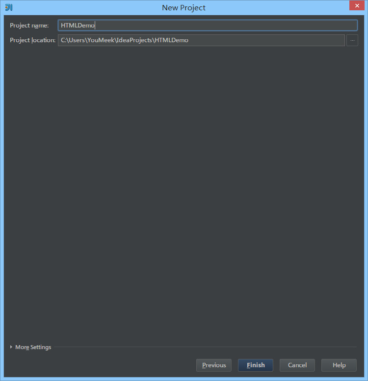
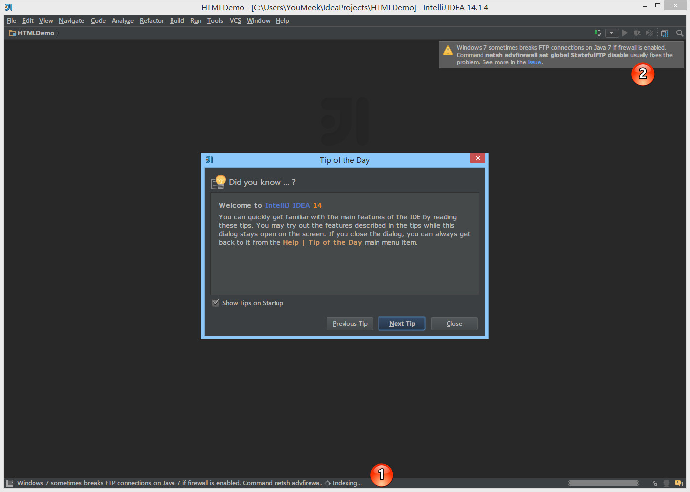
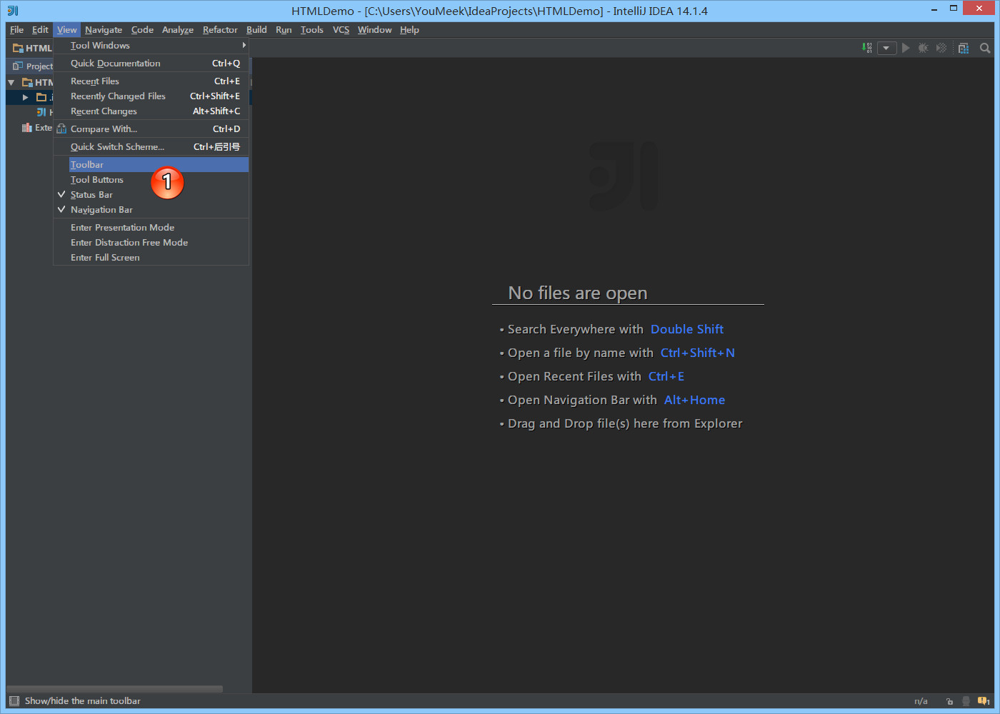

# 首次使用的基础设置

## 目录

* [UI界面](#UI界面)
  * [首次打开](#首次打开)
  * [新建HTML项目](#新建HTML项目)
  * [界面介绍](#界面介绍)
* [设置](#设置)
  * [主题](#主题)
  * [字体](#字体)
  * [编辑区主题](#编辑区主题)
  * [文件编码](#文件编码)
  * [乱码问题](#乱码问题)
* [Donate](#Donate)
* [About](#About)
* [License](#License)


## UI界面

### 首次打开


* **重点说明：** IntelliJ IDEA 是没有类似 Eclipse 的工作空间的概念 (`Workspaces`)，最大单元就是 `Project`。如果你同时观察多个项目的情况，IntelliJ IDEA 提供的解决方案是打开多个项目实例，你可以理解为开多个项目窗口。 
* 命令 `Create New Project` 创建一个新项目。
* 命令 `Import Project` 导入一个已有项目。
* 命令 `Open` 打开一个已有项目，可以直接打开 Eclipse 项目，但是由于两者 IDE 下的项目配置不一样，所以项目还是需要配置的。
* 命令 `Check out from Version Control` 可以通过服务器上的项目地址 Checkout Github 上面项目或是其他 Git 托管服务器上的项目。

为了介绍 IntelliJ IDEA 界面，我们这里创建一个新 HTML 项目。

### 新建HTML项目




### 界面介绍



* 对于首次创建或打开的新项目，IntelliJ IDEA 都会创建项目索引，如上图①所示。大型项目在创建索引过程中可能必须会卡顿，所以 **强烈建议** 创建索引过程最好不要动项目。
* 每次进入项目中，IntelliJ IDEA 会根据当前项目情况进行问题反馈，或是升级更新提示等。使用方式如上图②所示。



如上图，IntelliJ IDEA 默认界面是隐藏掉 `Toolbar` 和 `Tool Buttons`，我个人习惯看到这两个，所以一般都会进行开启。


如上图①所示为开启 `Toolbar` 和 `Tool Buttons` 效果。


## 设置

### 主题


* 上图①所示为 IntelliJ IDEA 修改主题的地方，可以通过打开左上角的File -> Setting。在 Windows 系统上 IntelliJ IDEA 默认提供的主题有四套：`Darcula`、`IntelliJ`、`Windows`、`Alloy. IDEA Theme`。除了 `Darcula` 是黑色主题，其他三套都是以白色为背景的。
* 其他操作系统上不一定会也有四套主题的，主题的选择上大家根据自己喜好即可。改变主题需要重启 IntelliJ IDEA 方可看到效果。

### 字体


* 如上图①所示，IntelliJ IDEA 主题字体的修改要先勾选 `Override default fonts by` 。默认 IntelliJ IDEA 是不推荐修改的，但是由于字体是有分包含中文和不包含中文之分的，一般使用英文的国家是不需要额外担心乱码问题的，而我们需要。
* 字体的审美上每个人不一样，但是如上一段说的，这里的字体修改是需要知道一个前提的，那就是你选择的那个字体必须含有中文，比如微软雅黑和宋体这类是包含中文的，而 `Courier New` 和 `Monaco` 这类只是单纯的英文字体。
* 如果你选择的字体不包含中文，那可能会在很多位置上出现类似 `口口口口口` 这样的乱码问题，比如文件名含有中文、字体是中文名字的都会变成 `口口口口口`。
* 在修改 IntelliJ IDEA 的主题字体的时候，不建议把字体调成很大，因为很多人遇到这样一种情况：显示器分辨率低，主题字体又大，在 IntelliJ IDEA 的某些操作的工具菜单、右键菜单选项中部分选项超出了分辨率显示范围，没办法被选中。当然了，如果你一定要把字体改大，又不用大分辨率显示器，那可以通过 IntelliJ IDEA 的 `Menus and Toolbars` 删除部分你认为用不到的菜单，但是一般不建议这样做。
* 还需要特别注意的时候，如果你是开着 IntelliJ IDEA 的时候，新装了一个字体的话，那必须重启IntelliJ IDEA 之后才能在下拉列表找到新装的字体。


* 如上图①所示，默认 IntelliJ IDEA 是不能直接在默认的代码模板上修改字体的，需要先 `Save As` 一份出来，然后才可以修改。这种设计在 IntelliJ IDEA 其他很多设置也是如此的，所以如果你还看到类似有 `Copy`、`Save As` 这类选项的按钮就要想到是此设计思想。
* 如上图②所示，勾选的 `Show only monospaced fonts` 表示筛选显示系统上的等宽字体。由于 Windows 系统上等宽字体并不多，勾选此选项出现的下拉字体可选择就很少。取消勾选之后，就可以显示系统上所有已安装的字体。
* 如上图③所示，其中编码字体有第一字体（`Primary font`） 和 第二字体（`Secondary font`）之分。当有些字符在第一字体支持不了的时候，会去使用第二字体进行支持。
* 我个人习惯上：英文字体使用 `Monaco`，由于此字体不支持中文，所以我把这个设置为第一字体，第二字体使用 `Yahei Consolas Hybrid` 进行支持，该字体含有中文。这两个字体都不是系统自带的，需要自行下载安装。
* 如果你的第一字体不包含中文的话，第二字体包含中文，那在有些地方也还是会出现 `口口口口口` 这类问题，比如 `Ctrl + Shift + N` 进行查找文件的时候，如果你输入中文也会变成 `口口口口口` ，我个人文件名为中文的不多，所以就容忍了这种情况。如果你不愿意容忍这种情况，那还是回到最开始的要求：第一字体包含中文。


* 如上图为控制台输出内容字体修改，有很多 IntelliJ IDEA 新人在做输出的时候出现乱码原因就是因为没有在这里进行设置。
* *控制台输出字体* 修改的原理跟 *代码编辑字体修改* 是一样的，所以这里不进行讲解。

### 编辑区主题

### 文件编码

### 乱码问题


## Donate

感谢您的耐心阅读，如果您发现文章中有一些没表述清楚的，或者是不对的地方，请给我留言，你的鼓励是作者写作最大的动力。

如果您认为本文质量不错，读后觉得收获很大，不妨小额赞助我一下，让我更有动力继续写出高质量的文章。


## About

* **作者**：March
* **邮箱**：fengqi.mao.march@gmail.com
* **码云**：https://gitee.com/maofengqi
* **头条**：https://toutiao.io/u/425956/subjects
* **简书**：https://www.jianshu.com/u/02f2491c607d
* **掘金**：https://juejin.im/user/5b484473e51d45199940e2ae
* **知乎**：http://zhihu.com/people/maofengqi
* **豆瓣**：https://www.douban.com/people/maofengqi/
* **CSDN**：http://blog.csdn.net/u011810138
* **Github**：https://github.com/maoqiqi
* **开源中国**：https://my.oschina.net/maoqiqi
* **喜马拉雅听书**：https://www.ximalaya.com/zhubo/31419312/
* **SegmentFault**：https://segmentfault.com/u/maoqiqi
* **StackOverFlow**：https://stackoverflow.com/users/8223522


## License

```
   Copyright 2019 maoqiqi

   Licensed under the Apache License, Version 2.0 (the "License");
   you may not use this file except in compliance with the License.
   You may obtain a copy of the License at

       http://www.apache.org/licenses/LICENSE-2.0

   Unless required by applicable law or agreed to in writing, software
   distributed under the License is distributed on an "AS IS" BASIS,
   WITHOUT WARRANTIES OR CONDITIONS OF ANY KIND, either express or implied.
   See the License for the specific language governing permissions and
   limitations under the License.
```