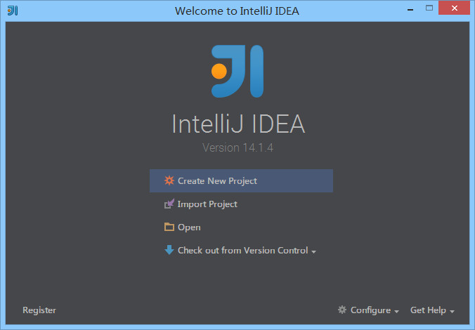

# 首次使用的基础设置

## 目录

* [UI界面](#UI界面)
  * [首次打开](#首次打开)
  * [新建HTML项目](#新建HTML项目)
  * [界面介绍](#界面介绍)
* [设置](#设置)
  * [主题](#主题)
  * [字体](#字体)
  * [编辑区主题](#编辑区主题)
  * [文件编码](#文件编码)
  * [乱码问题](#乱码问题)
* [Donate](#Donate)
* [About](#About)
* [License](#License)


## UI界面

### 首次打开



* **重点说明：** IntelliJ IDEA 是没有类似 Eclipse 的工作空间的概念 (`Workspaces`)，最大单元就是 `Project`。如果你同时观察多个项目的情况，IntelliJ IDEA 提供的解决方案是打开多个项目实例，你可以理解为开多个项目窗口。 
* 命令 `Create New Project` 创建一个新项目。
* 命令 `Import Project` 导入一个已有项目。
* 命令 `Open` 打开一个已有项目，可以直接打开 Eclipse 项目，但是由于两者 IDE 下的项目配置不一样，所以项目还是需要配置的。
* 命令 `Check out from Version Control` 可以通过服务器上的项目地址 Checkout Github 上面项目或是其他 Git 托管服务器上的项目。

为了介绍 IntelliJ IDEA 界面，我们这里创建一个新 HTML 项目。

### 新建HTML项目


### 界面介绍


* 对于首次创建或打开的新项目，IntelliJ IDEA 都会创建项目索引，如上图①所示。大型项目在创建索引过程中可能必须会卡顿，所以 **强烈建议** 创建索引过程最好不要动项目。
* 每次进入项目中，IntelliJ IDEA 会根据当前项目情况进行问题反馈，或是升级更新提示等。使用方式如上图②所示。


如上图，IntelliJ IDEA 默认界面是隐藏掉 `Toolbar` 和 `Tool Buttons`，我个人习惯看到这两个，所以一般都会进行开启。


如上图①所示为开启 `Toolbar` 和 `Tool Buttons` 效果。


## 设置

### 主题

### 字体

### 编辑区主题

### 文件编码

### 乱码问题


## Donate

感谢您的耐心阅读，如果您发现文章中有一些没表述清楚的，或者是不对的地方，请给我留言，你的鼓励是作者写作最大的动力。

如果您认为本文质量不错，读后觉得收获很大，不妨小额赞助我一下，让我更有动力继续写出高质量的文章。


## About

* **作者**：March
* **邮箱**：fengqi.mao.march@gmail.com
* **码云**：https://gitee.com/maofengqi
* **头条**：https://toutiao.io/u/425956/subjects
* **简书**：https://www.jianshu.com/u/02f2491c607d
* **掘金**：https://juejin.im/user/5b484473e51d45199940e2ae
* **知乎**：http://zhihu.com/people/maofengqi
* **豆瓣**：https://www.douban.com/people/maofengqi/
* **CSDN**：http://blog.csdn.net/u011810138
* **Github**：https://github.com/maoqiqi
* **开源中国**：https://my.oschina.net/maoqiqi
* **喜马拉雅听书**：https://www.ximalaya.com/zhubo/31419312/
* **SegmentFault**：https://segmentfault.com/u/maoqiqi
* **StackOverFlow**：https://stackoverflow.com/users/8223522


## License

```
   Copyright 2019 maoqiqi

   Licensed under the Apache License, Version 2.0 (the "License");
   you may not use this file except in compliance with the License.
   You may obtain a copy of the License at

       http://www.apache.org/licenses/LICENSE-2.0

   Unless required by applicable law or agreed to in writing, software
   distributed under the License is distributed on an "AS IS" BASIS,
   WITHOUT WARRANTIES OR CONDITIONS OF ANY KIND, either express or implied.
   See the License for the specific language governing permissions and
   limitations under the License.
```