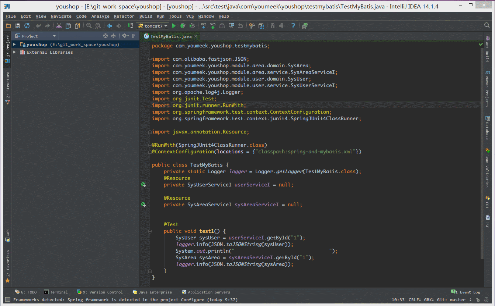
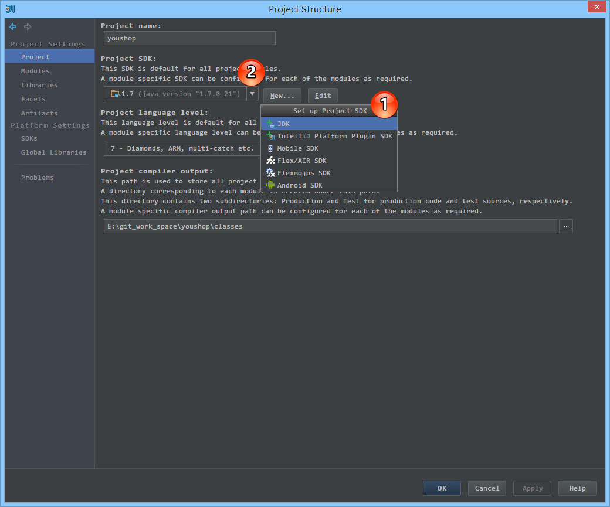
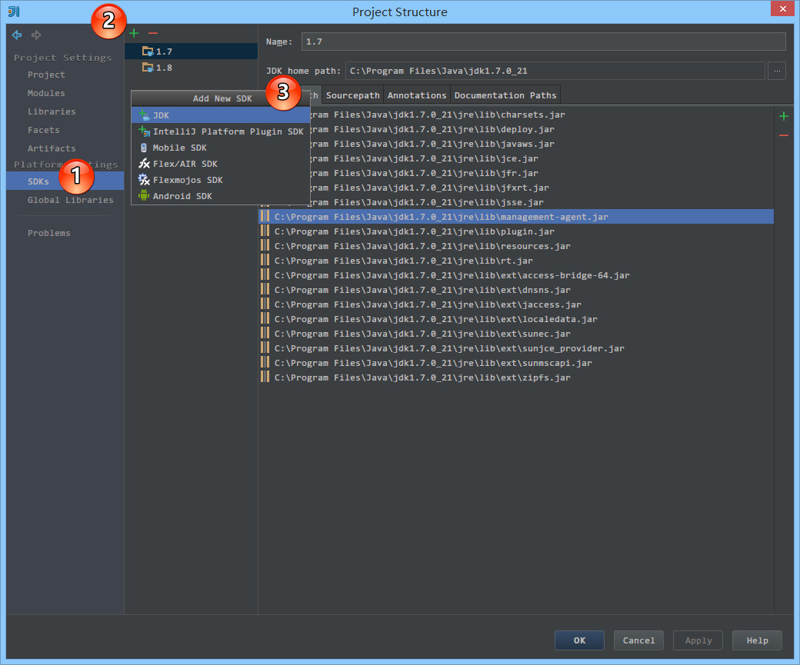
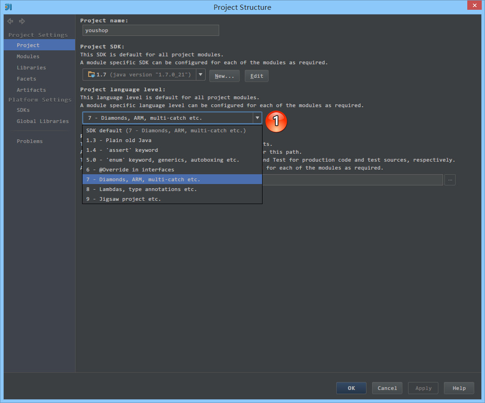
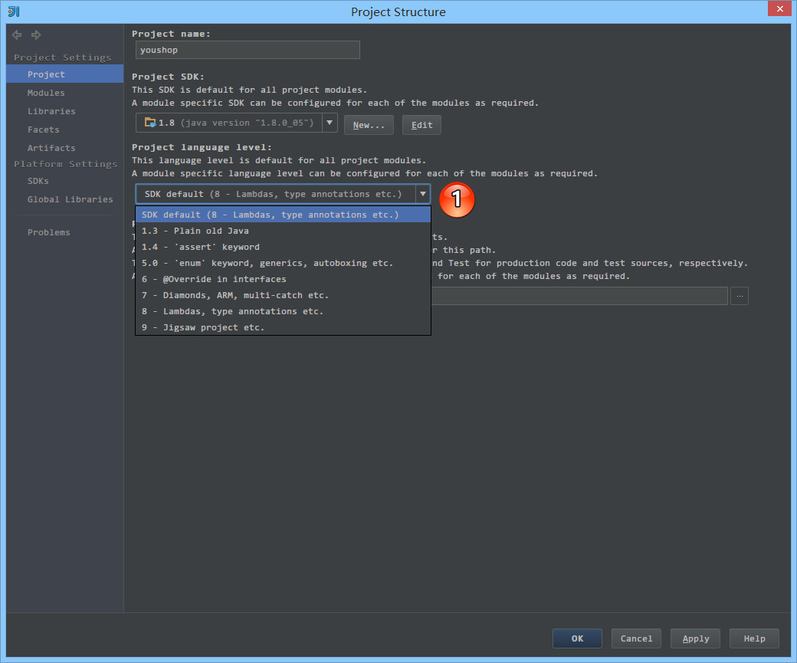
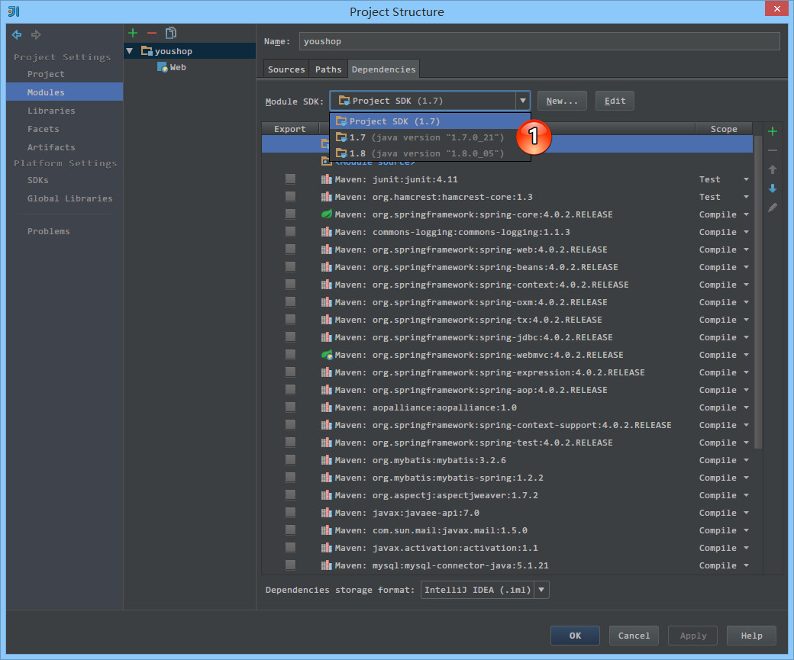
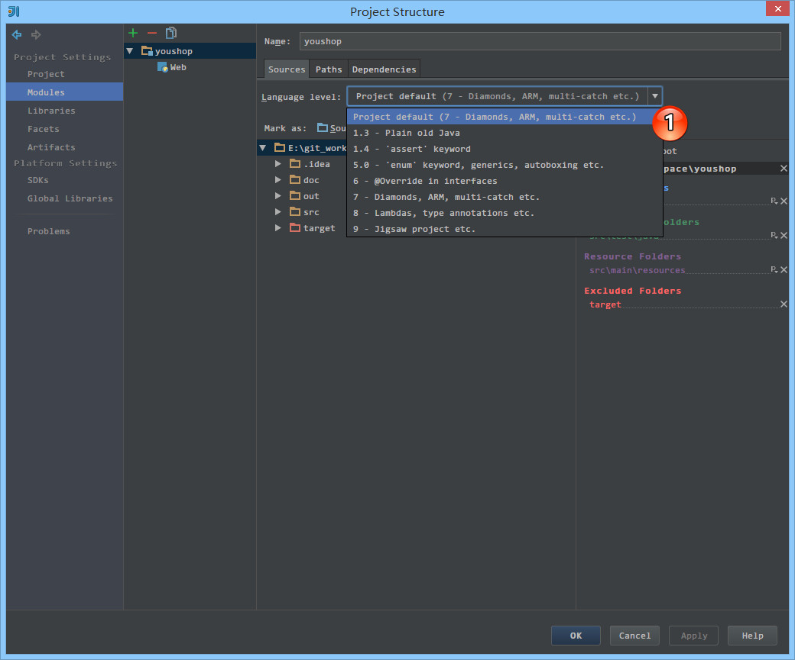

# 项目相关的几个重要概念说明

## 必备材料介绍

> * IntelliJ IDEA 对其他 IDE 转过来的用户有特别优待，对其专门整理了非常棒的资料，还请其他 IDE 过来的用户抽时间查看，会有很大帮助：
>
>> * Eclipse 用户可以看：<https://www.jetbrains.com/idea/help/eclipse.html>
>> * NetBeans 用户可以看：<https://www.jetbrains.com/idea/help/netbeans.html>

## Project 和 Module 介绍

这两个概念是 IntelliJ IDEA 的必懂知识点之一，请务必要学会。

如果你是 Eclipse 用户，并且已经看了上面给的链接，那 IntelliJ IDEA 首先告诉你一个非常重要的事情：IntelliJ IDEA 没有类似 Eclipse 工作空间（workspace）的概念的。很多从 Eclipse 转过来的人总是下意识地要再同一个窗口管理 n 个项目，这在 IntelliJ IDEA 是无法得到。IntelliJ IDEA 提供的体验是：一个 Project 打开一个 Window 窗口。

对于 Project，IntelliJ IDEA 是这样解释的：

> * Whatever you do in IntelliJ IDEA, you do that in the context of a project. A project is an organizational unit that represents a complete software solution. It serves as a basis for coding assistance, bulk refactoring, coding style consistency, etc.
> * Your finished product may be decomposed into a series of discrete, isolated modules, but it's a project definition that brings them together and ties them into a greater whole.
> * Projects don't themselves contain development artifacts such as source code, build scripts, or documentation. They are the highest level of organization in the IDE, and they define project-wide settings as well as collections of what IntelliJ IDEA refers to as modules and libraries. 
>
>> * 20170630 更新新地址：<https://www.jetbrains.com/help/idea/about-projects.html>

对于 Module，IntelliJ IDEA 是这样解释的：

> * A module is a discrete unit of functionality which you can compile, run, test and debug independently.
> * Modules contain everything that is required for their specific tasks: source code, build scripts, unit tests, deployment descriptors, and documentation. However, modules exist and are functional only in the context of a project.
> * Configuration information for a module is stored in a .iml module file. By default, such a file is located in the module's content root folder.
> * Development teams, normally, share the .iml module files through version control.
>
>> * 20170630 更新新地址：<https://www.jetbrains.com/help/idea/about-modules.html?search=About>

通过上面的介绍我们知道，在 IntelliJ IDEA 中 Project 是最顶级的级别，次级别是 Module。一个 Project 可以有多个 Module。目前主流的大型项目结构都是类似这种多 Module 结构，这类项目一般是这样划分的，比如：core Module、web Module、plugin Module、solr Module 等等，模块之间彼此可以相互依赖。通过这些 Module 的命名也可以看出，他们之间应该都是处于同一个项目业务情况下的模块，彼此之间是有不可分割的业务关系的。

所以我们现在总结：一个 `Project` 是由一个或多个 `Module` 组成，模块之间尽量是处在同一个项目业务的的情况下，彼此之间互相依赖关联。这里用的是 `尽量`，因为 IntelliJ IDEA 的 Project 是一个没有具备任何编码设置、构建等开发功能的，主要起到一个项目定义、范围约束、规范等类型的效果，也许我们可以简单地理解为就是一个单纯的目录，只是这个目录命名上必须有其代表性的意义。

下面我们以著名的 `spring-framework` 项目为例介绍多 Module 的结构的：

> * 项目主页：<https://github.com/spring-projects/spring-framework>：
> * 该项目的 `Project` 命名是：spring-framework。该目录主要作用为各个 `Module` 的顶层目录进行约束，告诉协同者，这个目录下都是 `spring-framework` 相关的，我绝不会放 Android 相关源码、文档、文件在上面的。该目录并不是以一个实际性的目录来体现的，所以你访问主页是看不到的，但是当你 `checkout` 的时候，你必须为这个项目命名，至于命名默认就是 `spring-framework`。
> * 该 `Project` 下有二十来个 `Module`，各个 `Module` 的命名也是有含义的，比如：`spring-core`、`spring-jdbc`、`spring-jms`、`spring-orm`、`spring-web`、`spring-webmvc` 等等，我们通过这些命名也能清楚地知道他们要表达的含义，这些 Module 下也都各自有 `src` 编码目录，可以自行编码和构建。

> * 相比较于多 Module 项目，小项目就无需搞得这么复杂。只有一个 Module 的结构 IntelliJ IDEA 也是支持的，并且 IntelliJ IDEA 创建项目的时候，默认就是单 Module 的结构的。
> * 如上图 Gif 图演示，在输入 `Project name` 的时候，`Module name` 和 `Module file Location` 自动进行改变，同时 `Project location` 和 `Module file Location` 完全一样，这也就表示，Project 目录和 Module 目录是同一个，所以此时 Project 目录下就会有 `src` 目录，但是我们应该明白其本质还是 Module 的目录。

关于 IntelliJ IDEA 的 Project 和 Module 终于解释清楚了，但是由于 IntelliJ IDEA 官网上又有一段话对此解释得不够好，特别是对 Eclipse 用户来讲：<https://www.jetbrains.com/idea/help/eclipse-faq.html>，其中有这样两句话：

> * An Eclipse workspace is similar to a project in IntelliJ IDEA
> * An Eclipse project maps to a module in IntelliJ IDEA

你可以把 IntelliJ IDEA 的 `Project` 当做 `workspace` 使用，IntelliJ IDEA 也是支持的，但是就像我们前面解释的那么那么多，这样是非常不符合其初衷的，所以请别把这段话当做教义去学习。对此 zeroturnaround 的大牛也有针对此进行了说明：<http://zeroturnaround.com/rebellabs/getting-started-with-intellij-idea-as-an-eclipse-user/3/>

## SDK（Software Development Kit） 介绍

> * 按 `Ctrl + Shift + Alt + S` 弹出项目结构设置区，如上图所示。
> * 如上图标注 1 所示，IntelliJ IDEA 支持 6 种 SDK。最常用的就是 `JDK` 和 `Android SDK`，其中在创建 `Android SDK` 的时候如果你没有先配置一个 `JDK` 的话，IntelliJ IDEA 则会提示你要先配置一个 `JDK`，然后才能配置 `Android SDK`。
> * 如上图标注 2 所示，下拉会展示已经创建的所有 SDK，可以很方便地不同 SDK 中切换。在开发 Java 项目过程中，由于 IntelliJ IDEA 支持管理多个 `JDK`，所以你完全不用担心你系统上不同项目需要不同 `JDK`。

> * 如上图标注 1 所示，`SDKs` 为 SDK 的统一管理处。
> * 如上图标注 2 所示，加号可以添加新 SDK，支持的类型如标注 3 所示；减号可以删除光标所选的 SDK。
> * 官网介绍：<https://www.jetbrains.com/idea/help/sdk.html>

## language level 介绍

其他 IDE 没有看到类似 `language level` 的设置，所以这个功能应该算是 IntelliJ IDEA 特有的，可是 IntelliJ IDEA 官网也没有专门介绍 `language level` 的地方，也许 IntelliJ IDEA 认为这个知识点属于 JDK 范畴所以没加以介绍吧。所以这里主要我对此的一些理解。我们应该知道 Java JDK 在每个新版本都会有其新特性，而新版本一般也会向下兼容旧版本的特性，IntelliJ IDEA 是对这些 JDK 的新特性是这样介绍的：

> * JDK 6 的新特性：@Override in interfaces
> * JDK 7 的新特性：Diamonds，ARM，multi-catch etc.
> * JDK 8 的新特性：Lambdas，type annotation etc.
> * JDK 9 的新特性：Jigsaw project etc.
>
>> * `etc. == et cetera == and so on == 等等`

> * 如上第一张图标注 1，使用的是 JDK 7，显示的 `SDK default` 为 `7 - Diamonds，ARM，multi-catch etc.`
> * 如上第二张图标注 1，使用的是 JDK 8，显示的 `SDK default` 为 `8 - Lambdas，type annotation etc.`

当我们使用 JDK 8 的时候，我们只能向下兼容 JDK 8 及其以下的特性，所以只能选择 8 及其以下的 `language level`。所以当我们项目使用的是 JDK 8，但是代码却没有使用 JDK 8 的新特性，最多使用了 JDK 7 的特性的时候我们可以选择 `7 - Diamonds，ARM，multi-catch etc.`。

对此我们总结 `language level`：限定项目编译检查时最低要求的 JDK 特性。

现在假设我们有一个项目代码使用的 JDK 8 新特性：`lambda` 语法，但是 JDK 选择的却是 JDK 7，即使 `language level` 选择了 `8 - Lambdas，type annotation etc.`，也是没有多大意义的，一样会编译报错。

## Module 下的 SDK 和 language level

对于大型项目，各个 Module 用到的 `SDK` 和 `language level` 很有可能是各不一样的，IntelliJ IDEA 对此也进行了支持。
 

> * 如上图标注 1 所示，可以针对 Module 选择其他 SDK，默认选择的是 `Project SDK`

> * 如上图标注 1 所示，可以针对 Module 选择其他 `language level`，默认选择的是 `Project language level`
 