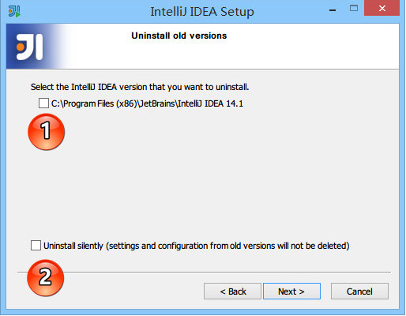
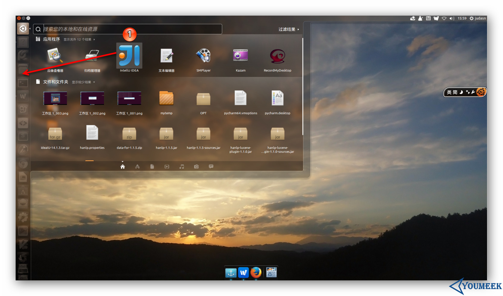

# 安装 IntelliJ IDEA

系统要求：https://www.jetbrains.com/help/idea/installation-guide.html

## 目录

* [Windows系统](#Windows系统)
* [Mac系统](#Mac系统)
* [Ubuntu系统](#Ubuntu系统)
* [安装总结](#安装总结)
* [首次运行向导](#首次运行向导)
* [安装后生成的目录说明和VM设置](#安装后生成的目录说明和VM设置)
* [Donate](#Donate)
* [About](#About)
* [License](#License)


## Windows系统

IntelliJ IDEA 的安装是非常简单的，不需要做过多的选择，可以说简单到都是 `Next` 即可。


> * ① 表示在桌面上创建一个快捷图标，建议勾选上，方便我们在安装后定位 IntelliJ IDEA 安装目录。
> * ② 表示关联 Java 和 Groovy 文件，建议都不要勾选，正常我们在 Windows 的文件系统上打开这类文件都是为了快速查阅文件里面的内容，如果关联上之后，由于 IntelliJ IDEA 打开速度缓慢，不方便我们查看。
> * 建议在 Windows 系统上关联此类文件可以用 EmEditor、Notepad++ 这类轻便的编辑器。

已有旧版本安装新版本：



> * 上图，显示我目前电脑中已经有一个 IntelliJ IDEA 版本，如果我勾选了①，则表示安装之前会先卸载掉电脑上的旧版本。
> * 如果勾选了② ，则 IntelliJ IDEA 会直接安静地卸载旧版本，而旧版本的个性化设置不会被删除。
> * 在小版本迭代中建议是卸载掉旧版本的，然后再进行新版本安装，因为小版本迭代一般都是 Bug 的修复，保留旧版本没有多大意义。
> * 在大版本迭代中建议是保留旧版本，也就是不勾选上图①，IntelliJ IDEA 是支持一台电脑装多个版本的。

接下来的步骤我们假设勾选了①再进行安装：


> * 上图，由于上一步勾选了卸载旧版本选项，所以出现了选择删除旧版本的配置选项。
> * 第一个选项：删除旧版本的缓存和本地历史记录。
> * 第二个选项：删除旧版本的个人个性化设置。建议两个都不要勾选。
> * 点击 uninstall，进入全自动的卸载过程，卸载完成接下来的步骤跟首次安装一致。


## Mac系统

Mac下安装安装 IntelliJ IDEA 与安装其他软件一样，不在叙述。

> 目前的最新 IntelliJ IDEA 版本已经默认都是使用它自己带的 JDK 环境。


如果你的 Mac 安装有多个 JDK，你想使用高版本的 JDK 运行 IntelliJ IDEA 可以按如下方式进行修改：

* 在 `应用程序` 中找到 `IntelliJ IDEA` 然后对此进行 `右键 > 显示包内容 > Contents > Info.plist`，效果如上图所示。
* 找到上图红圈标注的代码，修改 `JVMVersion` 的属性值，如果是 JDK 7，则改为 `1.7*`。如果是 JDK 8，则改为 `1.8*`。


## Ubuntu系统

先把你下载到的 `ideaIU-2019.3.tar.gz` 移动到你平时存放软件的目录下，然后进行解压，我电脑是放在 `/opt` 下。
  
  * 终端下解压命令：`tar xfz ideaIU-2019.3.tar.gz`，解压出来的目录名称是：`idea-IU-2019.3`
  * 可能在解压过程中你需要 `sudo` 命令权限，或者是切换到 root 账号下。如果你是切换到 root 用户下就一定要注意，解压完记得再切回来你常用的账户，不然等下生成的 IntelliJ IDEA 配置文件是放在 `/home/root` 下，这样就跟你常用的那个用户没啥关系了。

在假设你已经通过终端切换到了你常用的用户下之后，现在用终端进入解压目录下的 `bin 子目录` 下，然后在终端下运行启动命令：`./idea.sh`，运行的效果下图所示。


剩下的配置步骤就跟 Windows 基本一样了，如下图①所示，所以这里不多讲。

其中，在整个首次启动的配置过程中，唯一跟 Windows 不太一样的就是下图标注①所示。原因是 Linux 下创建启动图标是非常非常非常的麻烦，所以 IntelliJ IDEA 帮我们考虑到了，所以只要勾选下即可解决这种麻烦事。


创建完启动图标之后，我们可以在如下图标注①所示的 Dash 这个地方找到 IntelliJ IDEA 图标。但是图标我们一般是放在启动栏上的，所以这里你可以按着箭头的方向拖动 IntelliJ IDEA 图标到启动栏上即可。



最终效果图如下：


> 卸载：Linux 的卸载是不需要执行程序的，只需要删除对应目录。
> * 删除主程序目录，也就是我们本文上面讲的解压出来的 `idea-IU-2019.3`。
> * 如果不想保留你的配置文件，还可以删除配置目录，目录所在位置：`./home/你用登录名/.IntelliJIdea2019`


## 安装总结

从硬件要求来看，IntelliJ IDEA 对硬件的要求看上去不是很高。可是实际在开发中其实并不是这样的，特别是开发 Java Web 的项目的计算机，2G 内存是基本不够用的。

我们现在来假设一种国内常见的开发环境：

> 有一个在开发的 Java Web 项目，它使用的框架为主流的：Struts + Spring + Hibernate，使用这三个框架的过程中，我们要引入大量的框架 jar 包，
在我们的 Web 容器启动时，这些框架jar包就要占用大量的内存，而且 IntelliJ IDEA 本身功能繁多，占用的内存也不算低，再加上我们这里还没计算计算机上的其他软件应用。
所以基本上 2G 内存的计算机只适合写小程序、小项目或是开发静态页面。

我个人建议，如果你是开发 Java Web 项目最好的方案是 8G 内存或是以上，硬盘能再用上固态是最好的，因为 IntelliJ IDEA 有大量的缓存、索引文件，
把 IntelliJ IDEA 的缓存、索引文件放在固态上，IntelliJ IDEA 流畅度也会加快很多。

**如果你正在使用 Eclipse / MyEclipse，想通过 IntelliJ IDEA 来解决计算机的卡、慢等问题，我这里可以直接明白地告诉你：这基本上是不可能的，本质上你应该对自己的硬件设备进行升级**。


## 首次运行向导

> * 假如你计算机上在过去已经有安装过 IntelliJ IDEA 的版本，且你在卸载 IntelliJ IDEA 的过程中，IntelliJ IDEA 的配置文件目录都没有删除，那安装新版本之后是不会有首次运行的功能向导的。
> * 假如你计算机上没有安装过 IntelliJ IDEA，或是 卸载 IntelliJ IDEA 过程中你删除了 IntelliJ IDEA 的配置文件目录，则当你双击运行桌面上的 IntelliJ IDEA 快捷图标，将进入下面介绍的向导过程。


* 第一个单选按钮：表示 IntelliJ IDEA 识别到我计算机上有 IntelliJ IDEA 版本的旧配置，如果我选择了该选项，则 IntelliJ IDEA 将自动把旧版本的配置文件转移到新版本的配置文件目录上。如果你计算机上首次安装一般是没有该选项的。
* 第二个单选按钮：表示你可以指定 IntelliJ IDEA 导入你计算机上存在其他目录的 IntelliJ IDEA 配置文件目录，如果你有的话。
* 第三个单选按钮：表示你没有任何早期版本的 IntelliJ IDEA 配置，你不导入任何配置，让 IntelliJ IDEA 生成一份新的配置。


上图默认选择中的是 `Buy IntelliJ IDEA`，验证 IntelliJ IDEA 的许可有如图三种方式，我们这里使用的是 30 天试用版本进行演示，故单击 `Evaluate for free for 30 days` 进行下一步。


上图选择的时候 IntelliJ IDEA 主题 UI，在 Windows 系统版本中 IntelliJ IDEA 自带了 4 个主题，但是用的最多的就是上图这 2 种，其中大家基本偏爱黑色的 `Darcula`。这个没有好坏之分，根据你的喜好来进行选择。


上图显示了 IntelliJ IDEA 支持的主要的一些扩展功能或者说是工具、插件也可以。你可以根据自己开发的需求进行禁用一些扩展，这样可以稍微减轻 IntelliJ IDEA 运行时所占内存，加快运行速度，但是效果并不会很明显就是。

我们这里点击 `Java Frameworks` 的 `Customize` 进行下一步操作。


上图显示了 IntelliJ IDEA 所以支持的 `Java Frameworks`。我们可以根据自己的开发需求不启用指定框架的。对于不启用的框架，我们也可以在后期进行重新勾选，这会在 IntelliJ IDEA 插件那一讲进行专门讲解。

选择好自己所需的扩展功能后，按 `Start using IntelliJ IDEA` 显示启动界面，进度条走完之后，进入 IntelliJ IDEA 编码世界！


## 安装后生成的目录说明和VM设置

### 安装目录介绍


* IntelliJ IDEA 的安装目录并不复杂，上图为最常改动的 bin 目录，经常会改动的文件或是必须介绍就是如图红色框中的几个。
* `idea.exe` 文件是 IntelliJ IDEA 32 位的可行执行文件，IntelliJ IDEA 安装完默认发送到桌面的也就是这个执行文件的快捷方式。
* `idea.exe.vmoptions` 文件是 IntelliJ IDEA 32 位的可执行文件的 VM 配置文件，具体配置修改会下面进行专门讲解。
* `idea64.exe` 文件是 IntelliJ IDEA 64 位的可行执行文件，要求必须电脑上装有 JDK 64 位版本。64 位的系统也是建议使用该文件。
* `idea64.exe.vmoptions` 文件是 IntelliJ IDEA 64 位的可执行文件的 VM 配置文件，具体配置修改会下面进行专门讲解。
* `idea.properties` 文件是 IntelliJ IDEA 的一些属性配置文件，具体配置修改会下面进行专门讲解。
* **强烈推荐不要直接修改安装目录下的这几个配置文件，因为 IDEA 升级/重装可能会导致修改完全失效！**
* **强烈推荐使用 IDEA 自带菜单中的 `Help -> Edit Custom VM Options` 和 `Help -> Edit Custom Properties` 来进行参数个性化配置！**

### 设置目录介绍


* 不管你使用的是哪个操作系统，IntelliJ IDEA 的设置目录命名是统一的、有规律：.IntelliJIdea14。其中 14 表示大版本号，如果你电脑上还同时装有 13 的版本，那则还应该会有一个：`.IntelliJIdea13` 的设置目录，其他版本道理一样。 
* 在三大主流的操作系统上该文件夹都在当前用户的 Home 目录，Windows 上即 `%userprofile%`，Linux 和 Mac 上即 `~`
* 对于这个设置目录有一个特性，就是你删除掉整个目录之后，重新启动 IntelliJ IDEA 会再自动帮你再生成一个全新的默认配置，所以很多时候如果你把 IntelliJ IDEA 配置改坏了，没关系，删掉该目录，一切都会还原到默认，我是很建议新人可以多自己摸索 IntelliJ IDEA 的配置，多几次还原，有助于加深对 IntelliJ IDEA 的了解。
* `config` 目录是 IntelliJ IDEA 个性化化配置目录，或者说是整个 IDE 设置目录。也是我个人认为最重要的目录，没有之一，如果你还记得安装篇的介绍的时候，安装新版本的 IntelliJ IDEA 会自动扫描硬盘上的旧配置目录，指的就是该目录。这个目录主要记录了：IDE 主要配置功能、自定义的代码模板、自定义的文件模板、自定义的快捷键、Project 的 tasks 记录等等个性化的设置。
* `system` 目录是 IntelliJ IDEA 系统文件目录，是 IntelliJ IDEA 与开发项目一个桥梁目录，里面主要有：缓存、索引、容器文件输出等等，虽然不是最重要目录，但是也是最不可或缺目录之一。

### 配置文件常见修改内容说明


> * 上图是 64 位可执行文件的 JVM 配置文件内容，如果你是 32 位的系统你应该修改的是 `idea.exe.vmoptions` 文件里面的内容，但是由于 32 位系统内存一般都是 2G 左右的，所以也没有多大空间可以调整，所以一般无需调整的。
> * 修改的原则主要是根据自己机器的内存情况来判断的，我个人是建议 8G 以下的机子或是静态页面开发者都是无需修改的。如果你是开发大型项目、Java 项目或是 Android 项目，并且内存大于 8G，建议进行修改，常修改的就是下面 4 个参数，我这里主要以我的机子为例进行建议，每个人机子情况不一，这里也只是做一个引子，最好的调整方式是你可以根据 jconsole 这类工具进行观察后个性化调整。
> * **强烈推荐**使用 IDEA 自带菜单中的 `Help -> Edit Custom VM Options` 来进行个性化配置，而不是直接修改安装目录中的该文件！
> 
>> * `-Xms128m`，16 G 内存的机器可尝试设置为 `-Xms512m`
>> * `-Xmx750m`，16 G 内存的机器可尝试设置为 `-Xmx1500m`
>> * `-XX:MaxPermSize=350m`，16G 内存的机器可尝试设置为 `-XX:MaxPermSize=500m` (PS：2017 后的版本该参数被剔除)
>> * `-XX:ReservedCodeCacheSize=225m`，16G 内存的机器可尝试设置为 `-XX:ReservedCodeCacheSize=500m`


> * 上图是 IntelliJ IDEA 一些属性配置，没有 32 位和 64 位之分，修改原则主要根据个人对 IntelliJ IDEA 的个性化配置情况来分析。
> * **强烈推荐**在阅读了安装目录中的带注释的配置文件后，使用 IDEA 自带菜单中的 `Help -> Edit Custom Properties` 来进行个性化配置！
> * 常修改的就是下面 4 个参数：
>
>> * `idea.config.path=${user.home}/.IntelliJIdea/config`，该属性主要用于指向 IntelliJ IDEA 的个性化配置目录，默认是被注释，打开注释之后才算启用该属性，这里需要特别注意的是斜杠方向，这里用的是正斜杠。
>> * `idea.system.path=${user.home}/.IntelliJIdea/system`，该属性主要用于指向 IntelliJ IDEA 的系统文件目录，默认是被注释，打开注释之后才算启用该属性，这里需要特别注意的是斜杠方向，这里用的是正斜杠。如果你的项目很多，则该目录会很大，如果你的 C 盘空间不够的时候，还是建议把该目录转移到其他盘符下。
>> * `idea.max.intellisense.filesize=2500`，该属性主要用于提高在编辑大文件时候的代码帮助。IntelliJ IDEA 在编辑大文件的时候还是很容易卡顿的。
>> * `idea.cycle.buffer.size=1024`，该属性主要用于控制控制台输出缓存。有遇到一些项目开启很多输出，控制台很快就被刷满了没办法再自动输出后面内容，这种项目建议增大该值或是直接禁用掉，禁用语句 `idea.cycle.buffer.size=disabled`。

**Mac 下修改 VM 参数**

* 方法一(官方推荐)

  大部分情况下，修改 VM 参数可以使用 IDEA 自带的选项：`Help -> Edit Custom VM Options`
  这个选项会自动帮你在正确的位置用正确的名字新建一个 VM 参数配置文件，并在当前 IDEA 窗口自动打开。我们只需要按需编辑，保存后重启即可。
  建议在编辑的时候查看一下文件的原始路径，以备改错参数导致无法启动时恢复使用。这种方法修改不会由于升级 IDEA 导致修改被还原。

* 方法二

  手动修改个人配置下的 `idea.vmoptions` 文件，完整的路径为：`/Users/你的用户名/Library/Preferences/IntelliJIdeaXXXXXX/idea.vmoptions`
  或者可以简写为：`~/Library/Preferences/IntelliJIdeaXXXXXX/idea.vmoptions`。如果该文件不存在，按照名称新建一个即可。推荐直接使用命令行进行编辑。
  Finder 中进入该文件夹的方法是：
  * 打开 Finder
  * 按快捷键 Command + Shift + G
  * 在弹出窗口中输入 `~/Library/Preferences/`
  * 找到对应版本的 `IntelliJIdea` 文件夹
  * 新建或修改 `idea.vmoptions` 文件

**设置目录进行多台设置同步化处理**


* 上图是我的个性化配置目录，我是存放在 F 盘，同时该目录也是在 360 同步盘中。这样做主要是为了让我的多台设置可以同时使用一个个性化配置，保证个人开发习惯，额外作用就是在服务器上一个备份作用。
* 设置方式很简单，修改 `idea.properties` 属性文件中的 `idea.config.path` 值，我的机器为：`idea.config.path=F:/360SycDir/idea_config/config`.
* 如需要继续使用现存的配置，需将原个性化配置目录(config目录)，复制到修改后自定义的配置目录中。

**Mac 的配置文件保存路径**

* 下面内容中：`XXXXXX`，表示 IntelliJ IDEA 的版本号，IntelliJ IDEA 的配置目录是跟版本号有关系的。
* `/Users/你的用户名/Library/Application Support/IntelliJIdeaXXXXXX`，用于保存安装的插件
* `/Users/你的用户名/Library/Caches/IntelliJIdeaXXXXXX`，用于保存缓存、日志、以及本地的版本控制信息（local history 这个功能）
* `/Users/你的用户名/Library/Preferences/IntelliJIdeaXXXXXX`，用于保存你的个人配置，等价于 Windows 下的 `config` 目录

**Linux 的配置文件保存路径**

跟 Windows 的目录命名习惯一样，所以你可以直接按 Windows 的配置目录名称来全盘搜索。


## Donate

感谢您的耐心阅读，如果您发现文章中有一些没表述清楚的，或者是不对的地方，请给我留言，你的鼓励是作者写作最大的动力。

如果您认为本文质量不错，读后觉得收获很大，不妨小额赞助我一下，让我更有动力继续写出高质量的文章。


## About

* **作者**：March
* **邮箱**：fengqi.mao.march@gmail.com
* **码云**：https://gitee.com/maofengqi
* **头条**：https://toutiao.io/u/425956/subjects
* **简书**：https://www.jianshu.com/u/02f2491c607d
* **掘金**：https://juejin.im/user/5b484473e51d45199940e2ae
* **知乎**：http://zhihu.com/people/maofengqi
* **豆瓣**：https://www.douban.com/people/maofengqi/
* **CSDN**：http://blog.csdn.net/u011810138
* **Github**：https://github.com/maoqiqi
* **开源中国**：https://my.oschina.net/maoqiqi
* **喜马拉雅听书**：https://www.ximalaya.com/zhubo/31419312/
* **SegmentFault**：https://segmentfault.com/u/maoqiqi
* **StackOverFlow**：https://stackoverflow.com/users/8223522


## License

```
   Copyright 2019 maoqiqi

   Licensed under the Apache License, Version 2.0 (the "License");
   you may not use this file except in compliance with the License.
   You may obtain a copy of the License at

       http://www.apache.org/licenses/LICENSE-2.0

   Unless required by applicable law or agreed to in writing, software
   distributed under the License is distributed on an "AS IS" BASIS,
   WITHOUT WARRANTIES OR CONDITIONS OF ANY KIND, either express or implied.
   See the License for the specific language governing permissions and
   limitations under the License.
```