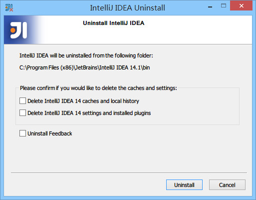
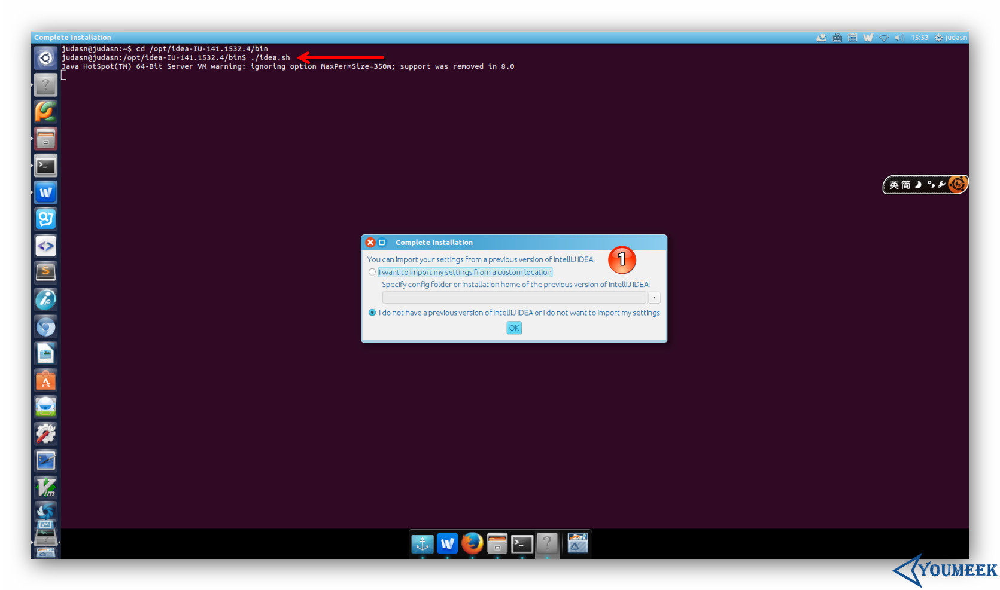

# 安装 IntelliJ IDEA

系统要求：https://www.jetbrains.com/help/idea/installation-guide.html

## 目录

* [Windows系统](#Windows系统)
* [Mac系统](#Mac系统)
* [Ubuntu系统](#Ubuntu系统)
* [安装总结](#安装总结)
* [首次运行向导](#首次运行向导)
* [Donate](#Donate)
* [About](#About)
* [License](#License)


## Windows系统

IntelliJ IDEA 的安装是非常简单的，不需要做过多的选择，可以说简单到都是 `Next` 即可。


> * ① 表示在桌面上创建一个快捷图标，建议勾选上，方便我们在安装后定位 IntelliJ IDEA 安装目录。
> * ② 表示关联 Java 和 Groovy 文件，建议都不要勾选，正常我们在 Windows 的文件系统上打开这类文件都是为了快速查阅文件里面的内容，如果关联上之后，由于 IntelliJ IDEA 打开速度缓慢，不方便我们查看。
> * 建议在 Windows 系统上关联此类文件可以用 EmEditor、Notepad++ 这类轻便的编辑器。

已有旧版本安装新版本：


> * 上图，显示我目前电脑中已经有一个 IntelliJ IDEA 版本，如果我勾选了①，则表示安装之前会先卸载掉电脑上的旧版本。
> * 如果勾选了② ，则 IntelliJ IDEA 会直接安静地卸载旧版本，而旧版本的个性化设置不会被删除。
> * 在小版本迭代中建议是卸载掉旧版本的，然后再进行新版本安装，因为小版本迭代一般都是 Bug 的修复，保留旧版本没有多大意义。
> * 在大版本迭代中建议是保留旧版本，也就是不勾选上图①，IntelliJ IDEA 是支持一台电脑装多个版本的。

接下来的步骤我们假设勾选了①再进行安装：



> * 上图，由于上一步勾选了卸载旧版本选项，所以出现了选择删除旧版本的配置选项。
> * 第一个选项：删除旧版本的缓存和本地历史记录。
> * 第二个选项：删除旧版本的个人个性化设置。建议两个都不要勾选。
> * 点击 uninstall，进入全自动的卸载过程，卸载完成接下来的步骤跟首次安装一致。


## Mac系统

Mac下安装安装 IntelliJ IDEA 与安装其他软件一样，不在叙述。

> 目前的最新 IntelliJ IDEA 版本已经默认都是使用它自己带的 JDK 环境。


如果你的 Mac 安装有多个 JDK，你想使用高版本的 JDK 运行 IntelliJ IDEA 可以按如下方式进行修改：

* 在 `应用程序` 中找到 `IntelliJ IDEA` 然后对此进行 `右键 > 显示包内容 > Contents > Info.plist`，效果如上图所示。
* 找到上图红圈标注的代码，修改 `JVMVersion` 的属性值，如果是 JDK 7，则改为 `1.7*`。如果是 JDK 8，则改为 `1.8*`。


## Ubuntu系统

先把你下载到的 `ideaIU-2019.3.tar.gz` 移动到你平时存放软件的目录下，然后进行解压，我电脑是放在 `/opt` 下。
  
  * 终端下解压命令：`tar xfz ideaIU-2019.3.tar.gz`，解压出来的目录名称是：`idea-IU-2019.3`
  * 可能在解压过程中你需要 `sudo` 命令权限，或者是切换到 root 账号下。如果你是切换到 root 用户下就一定要注意，解压完记得再切回来你常用的账户，不然等下生成的 IntelliJ IDEA 配置文件是放在 `/home/root` 下，这样就跟你常用的那个用户没啥关系了。

在假设你已经通过终端切换到了你常用的用户下之后，现在用终端进入解压目录下的 `bin 子目录` 下，然后在终端下运行启动命令：`./idea.sh`，运行的效果下图所示。



剩下的配置步骤就跟 Windows 基本一样了，如下图①所示，所以这里不多讲。

其中，在整个首次启动的配置过程中，唯一跟 Windows 不太一样的就是下图标注①所示。原因是 Linux 下创建启动图标是非常非常非常的麻烦，所以 IntelliJ IDEA 帮我们考虑到了，所以只要勾选下即可解决这种麻烦事。


创建完启动图标之后，我们可以在如下图标注①所示的 Dash 这个地方找到 IntelliJ IDEA 图标。但是图标我们一般是放在启动栏上的，所以这里你可以按着箭头的方向拖动 IntelliJ IDEA 图标到启动栏上即可。


最终效果图如下：


> 卸载：Linux 的卸载是不需要执行程序的，只需要删除对应目录。
> * 删除主程序目录，也就是我们本文上面讲的解压出来的 `idea-IU-2019.3`。
> * 如果不想保留你的配置文件，还可以删除配置目录，目录所在位置：`./home/你用登录名/.IntelliJIdea2019`


## 安装总结

从硬件要求来看，IntelliJ IDEA 对硬件的要求看上去不是很高。可是实际在开发中其实并不是这样的，特别是开发 Java Web 的项目的计算机，2G 内存是基本不够用的。

我们现在来假设一种国内常见的开发环境：

> 有一个在开发的 Java Web 项目，它使用的框架为主流的：Struts + Spring + Hibernate，使用这三个框架的过程中，我们要引入大量的框架 jar 包，
在我们的 Web 容器启动时，这些框架jar包就要占用大量的内存，而且 IntelliJ IDEA 本身功能繁多，占用的内存也不算低，再加上我们这里还没计算计算机上的其他软件应用。
所以基本上 2G 内存的计算机只适合写小程序、小项目或是开发静态页面。

我个人建议，如果你是开发 Java Web 项目最好的方案是 8G 内存或是以上，硬盘能再用上固态是最好的，因为 IntelliJ IDEA 有大量的缓存、索引文件，
把 IntelliJ IDEA 的缓存、索引文件放在固态上，IntelliJ IDEA 流畅度也会加快很多。

**如果你正在使用 Eclipse / MyEclipse，想通过 IntelliJ IDEA 来解决计算机的卡、慢等问题，我这里可以直接明白地告诉你：这基本上是不可能的，本质上你应该对自己的硬件设备进行升级**。


## 首次运行向导


## Donate

感谢您的耐心阅读，如果您发现文章中有一些没表述清楚的，或者是不对的地方，请给我留言，你的鼓励是作者写作最大的动力。

如果您认为本文质量不错，读后觉得收获很大，不妨小额赞助我一下，让我更有动力继续写出高质量的文章。


## About

* **作者**：March
* **邮箱**：fengqi.mao.march@gmail.com
* **码云**：https://gitee.com/maofengqi
* **头条**：https://toutiao.io/u/425956/subjects
* **简书**：https://www.jianshu.com/u/02f2491c607d
* **掘金**：https://juejin.im/user/5b484473e51d45199940e2ae
* **知乎**：http://zhihu.com/people/maofengqi
* **豆瓣**：https://www.douban.com/people/maofengqi/
* **CSDN**：http://blog.csdn.net/u011810138
* **Github**：https://github.com/maoqiqi
* **开源中国**：https://my.oschina.net/maoqiqi
* **喜马拉雅听书**：https://www.ximalaya.com/zhubo/31419312/
* **SegmentFault**：https://segmentfault.com/u/maoqiqi
* **StackOverFlow**：https://stackoverflow.com/users/8223522


## License

```
   Copyright 2019 maoqiqi

   Licensed under the Apache License, Version 2.0 (the "License");
   you may not use this file except in compliance with the License.
   You may obtain a copy of the License at

       http://www.apache.org/licenses/LICENSE-2.0

   Unless required by applicable law or agreed to in writing, software
   distributed under the License is distributed on an "AS IS" BASIS,
   WITHOUT WARRANTIES OR CONDITIONS OF ANY KIND, either express or implied.
   See the License for the specific language governing permissions and
   limitations under the License.
```