# Jetbrains 系列 IDE 使用技巧

> 作者：March    
> 链接：[Jetbrains 系列 IDE 使用技巧](https://github.com/maoqiqi/blog/blob/master/pages/jetbrains_ide.md)    
> 博客：http://blog.csdn.net/u011810138    
> 邮箱：fengqi.mao.march@gmail.com    
> 著作权归作者所有。商业转载请联系作者获得授权，非商业转载请注明出处。    

## Appearance & Behavior (外观和行为)

### Appearance

### Menus and Toolbars

### System Settings

### File Colors

### Scopes

### Notifications

### Quick Lists

### Path Variables


## Keymap

### 设置不同风格快捷键

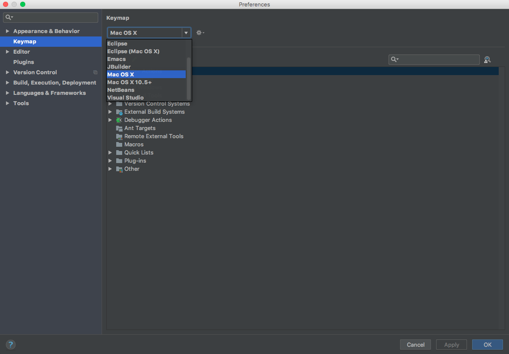

### 修改快捷键


## Editor

### General(普通设置)

#### Auto Import

#### Appearance

设置默认显示行号

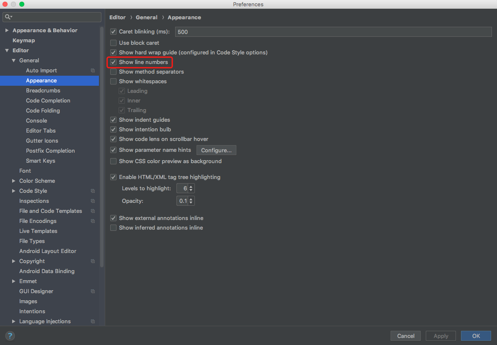

#### Breadcrumbs

#### Code Completion

#### Code Folding

#### Console

#### Editor Tabs

#### Gutter Icons

#### Postfix Completion

#### Smart Keys

### Font(字体)

打开Font，点击Save As新建自定义的字体配置，Size设置为16会比较好看。

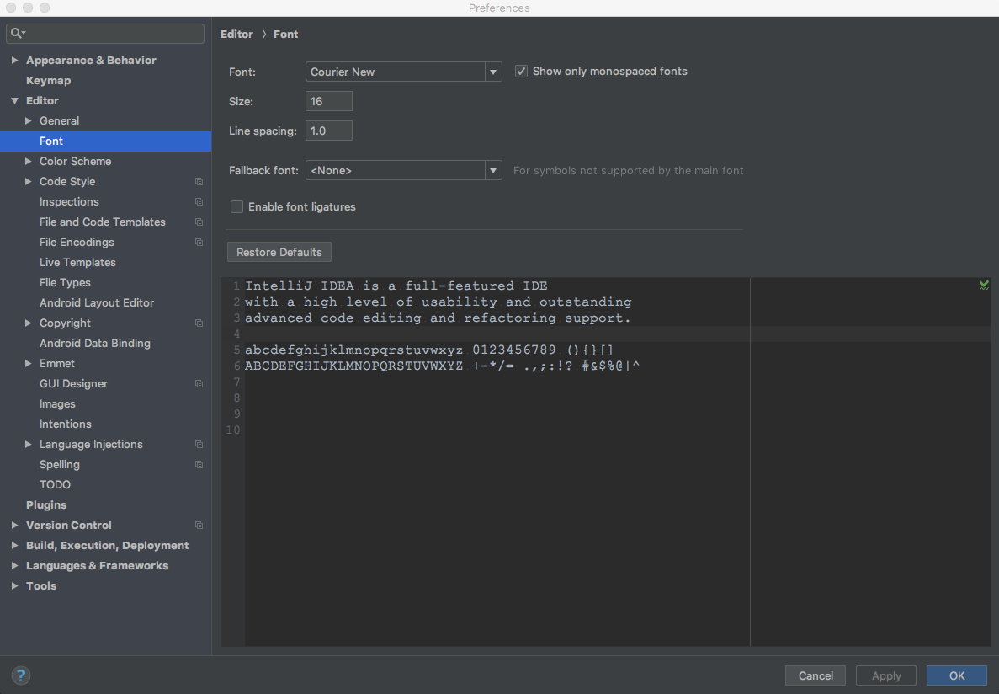

### Color Scheme(主题)

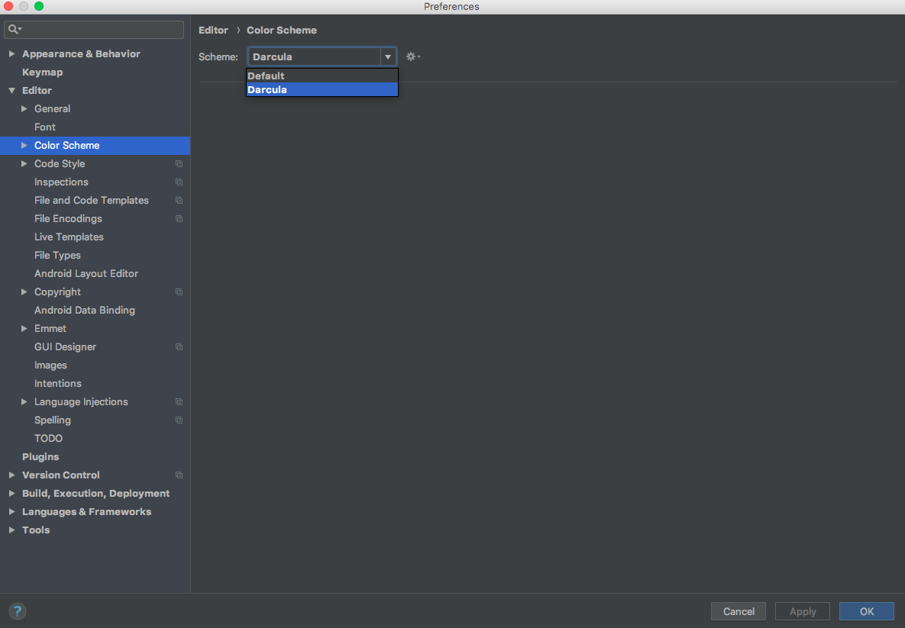

### Code Style

### Inspections

### File and Code Templates（文件和代码模板）

参考文档地址：https://www.jetbrains.com/help/idea/using-file-and-code-templates.html

### File Encodings

### Live Templates(模板)

1.代码自动补全

```java
public class Test {
    
    // psvm main方法
    public static void main(String[] args) {
        String str = "Hello World";
        // sout
        System.out.println();
        // soutv
        System.out.println("str = " + str);
        // soutm
        System.out.println("Test.main");
        // soutp
        System.out.println("args = [" + args + "]");
    }
}
```

**注意：** 自动补全的时候是Enter还是Tab?

在使用自动补全的时候Enter和Tab的行为还是有一些细微的区别的：

- 使用Enter会补全你选择的语句

- 使用Tab的话，会替换掉你之前在这里的内容（删除后面的语句直到遇到点号，逗号，分号）

2.编写自己的Live Templates

打开Live Templates，点击右边`+`，新建Templates Group，输入名称。

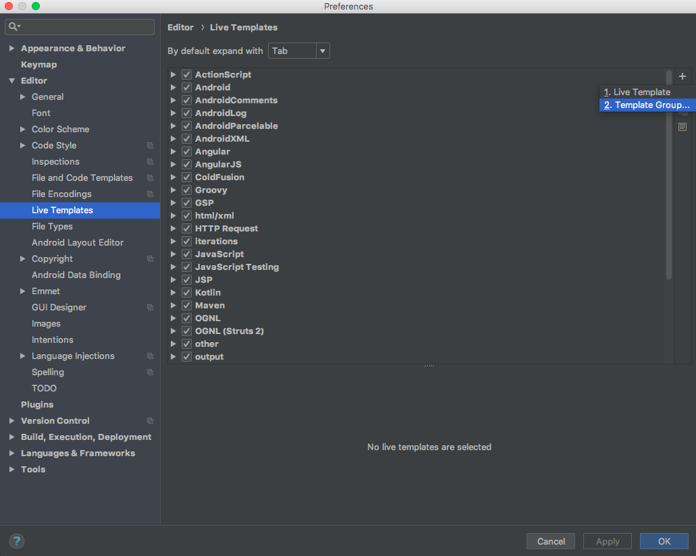

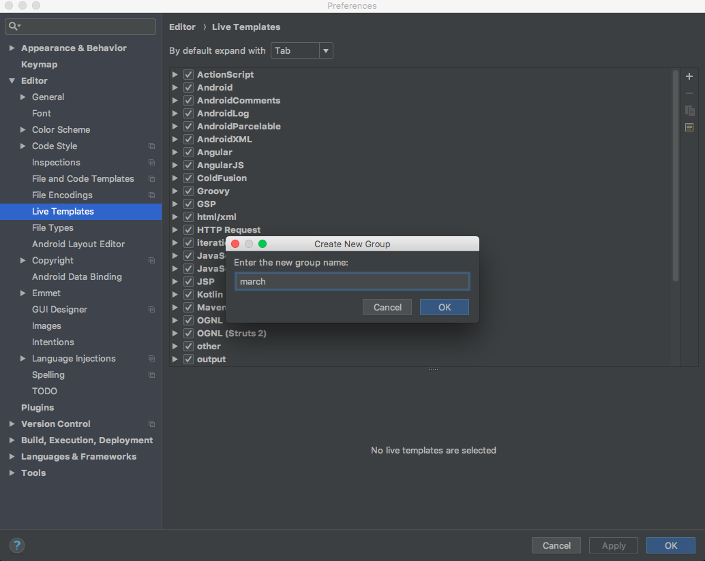

然后继续点击`+`，新建Live Templates，输入Abbreviation(缩写)、Description(描述)、Template text(模板文本)。

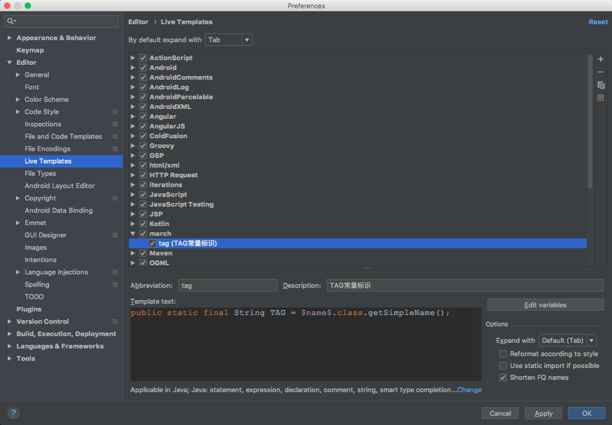

IDE提供了相关表达式可以实现某些操作，点击Edit variables编辑模板变量，在Expression中调用相关表达式。

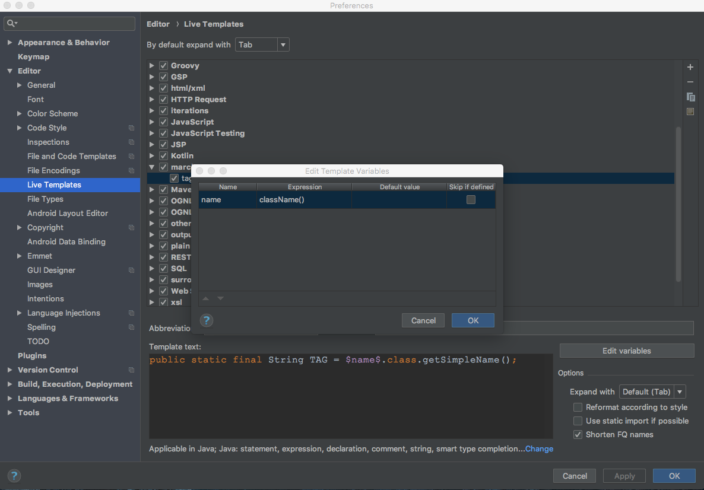

[Live Templates表达式参考文档地址][1]。

在Live Templates上右键选择Change context可以定义该Live Templates可以在哪些语言中使用。

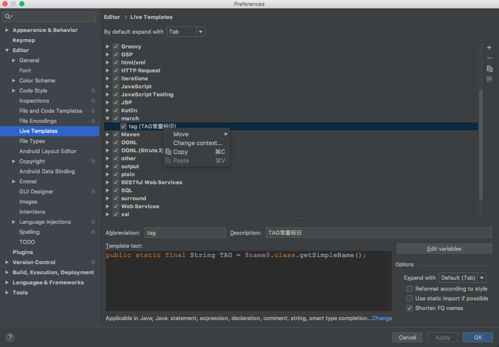

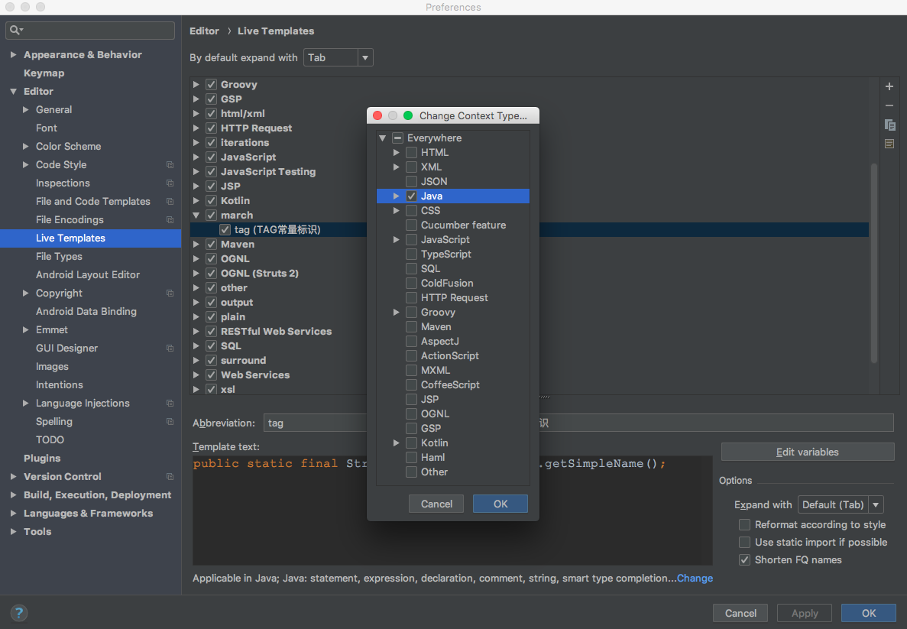

使用自定义Live Templates。

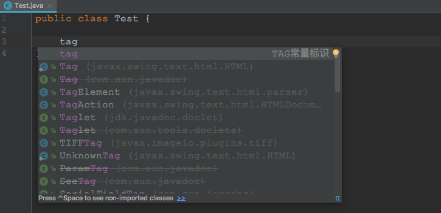

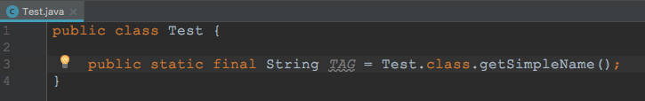

> 常用 java 模板

```
Abbreviation:

Description:

Template text:
```

> 常用 android 模板

```
Abbreviation:

Description:

Template text:
```

### File Types

### Android Layout Editor

### Copyright

### Android Data Binding

### Emmet

### GUI Designer

### Images

### Intentions

### Language Injections

### Spelling

### TODO

### General


## Plugins

## Version Control（版本控制）

### Background

### Changelists

### Commit Dialog

### Confirmation

### File Status Colors

### GitHub

### Ignored Files

### Issue Navigation

### Shelf

### CVS

### Git

### Mercurial

### Perforce

### Subversion

### TFS

## Build,Execution,Deployment（构建、执行、部署）


### Build Tools

### Compiler

### Debugger

### Remote Jar Repositories

### Deployment

### Arquillian Containers

### Application Servers

### Clouds

### Coverage

### Gradle-Android Compiler

### Instant Run

### Required Plugins


## Language & Frameworks（语言与框架）

### JavaScript

### Play Configuration

### Schemas and DTDs

### ColdFusion

### JavaFX

### Markdown

### OSGi

### OSGi Framework Instances

### Spring

### SQL Dialects

### SQL Resolution Scopes

### Stylesheets

### Template Data Languages

### TypeScript

### Web Contexts

### XSLT

### XSLT File Associations


## Tools

### Web Browsers

### External Tools

### Terminal

### Database

### SSH Terminal

### Diagrams

### Diff & Merge

### Remote SSH External Tools

### Server Certificates

### Settings Repository

### Startup Tasks

### Tasks

### Web Services

### XPath Viewer


https://blog.csdn.net/qq_31655965/article/details/52788374

https://blog.csdn.net/qq_31655965/article/details/53424531

http://www.ituring.com.cn/article/37792

https://www.oschina.net/question/12_70799

http://weishu.me/2015/12/11/shortcut-of-android-studio-you-may-not-know/

[1]:https://www.jetbrains.com/idea/help/creating-and-editing-template-variables.html