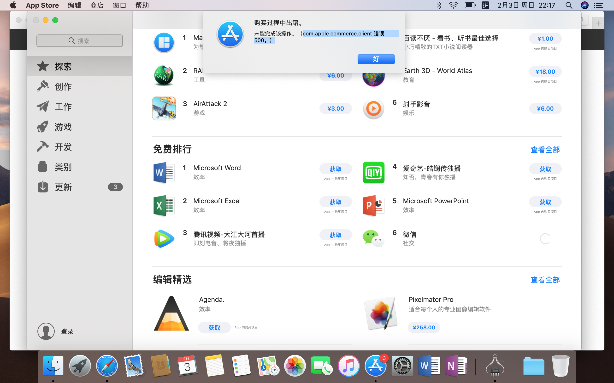
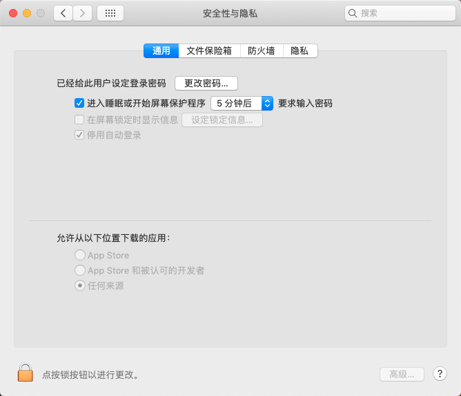
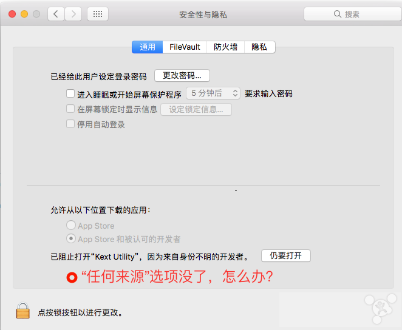
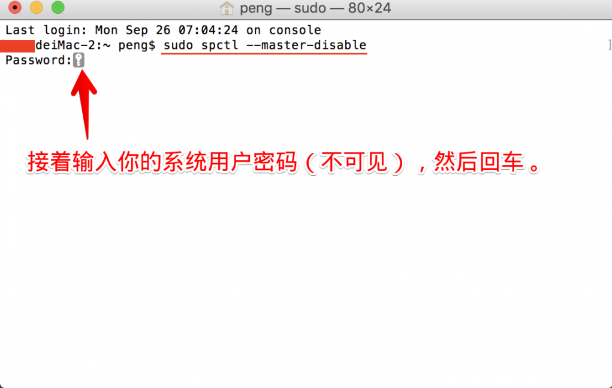
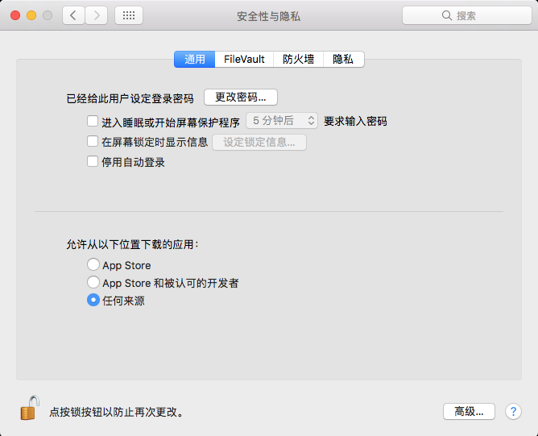

# Mac常见问题

记录在使用mac过程中遇到的各种问题。

## 目录

* [AppStore不能下载应用](#AppStore不能下载应用)
* [打不开安装包因为它来自身份不明的开发者](#打不开安装包因为它来自身份不明的开发者)
* [允许从任何来源下载应用程序](#允许从任何来源下载应用程序)
* [Donate](#Donate)
* [About](#About)
* [License](#License)  


## AppStore不能下载应用

点击下载输入密码后，提示：**购买过程中出错，未能完成该操作。(com.apple.commerce.client 错误 500。)**



解决方法：

* 打开终端(启动台->其他->终端)。
* 复制粘贴`defaults delete com.apple.appstore.commerce Storefront`这段代码,不作任何更改。
* 回车,重启后,再利用AppleId登录App Store即可。

如果上述步骤,未能解决该问题,建议联系技术支持部门。


## 打不开安装包因为它来自身份不明的开发者

在安装从别的地方下载来的Mac软件如office时，有可能安装不上，原因是系统默认设置了只能安装App Store和被认可的开发者的程序，因此只需要改变这一设置，就可以顺利安装了。

解决方法：

* 系统偏好设置->安全性与隐私->通用->点击通用页面左下角锁的图标
* 在弹框中输入密码(设置的密码不可以为空)
* 点击通用页面下方的**允许从以下位置下载的应用程序**下的**任何来源**选项。




## 允许从任何来源下载应用程序

苹果在2016年最新发布了macOS Sierra 10.12系统，可能好多小伙伴在升级后，发现系统偏好设置的**安全性与隐私**中默认已经去除了允许**任何来源**选项。
以往我们在Mac上安装一些未被认可来源的内容时需要打开该选项，否认一些第三方的应用可能会无法成功安装。那么接下来我们就来看看如何恢复**任何来源**的选项：

* 如果需要恢复允许 **任何来源** 的选项，即关闭Gatekeeper，请打开终端输入命令`sudo spctl --master-disable`。

  

* 接着输入你的系统用户密码(不可见)，然后回车。

  

* 这样久违的 **任何来源** 选项就回来了。

  
  
  > 需要说明的是，如果在系统偏好设置的“安全性与隐私”中重新选中允许App Store和被认可的开发者，即重新打开Gatekeeper后，允许“任何来源”选项会再次消失，可运行上述命令再次关闭Gatekeeper。

虽然这个方法是可以打开系统的“任何来源”选项，可以运行所有其它第三方应用程序，但同时也是有一定的风险的。
所以建议大家平时还是选择从App Store和被信任的开发者中运行程序，在必要的时候才将其打开。


## Donate

感谢您的耐心阅读，如果您发现文章中有一些没表述清楚的，或者是不对的地方，请给我留言，你的鼓励是作者写作最大的动力。

如果您认为本文质量不错，读后觉得收获很大，不妨小额赞助我一下，让我更有动力继续写出高质量的文章。


## About

* **作者**：March
* **邮箱**：fengqi.mao.march@gmail.com
* **头条**：https://toutiao.io/u/425956/subjects
* **简书**：https://www.jianshu.com/u/02f2491c607d
* **掘金**：https://juejin.im/user/5b484473e51d45199940e2ae
* **知乎**：http://zhihu.com/people/maofengqi
* **豆瓣**：https://www.douban.com/people/maofengqi/
* **CSDN**：http://blog.csdn.net/u011810138
* **Github**：https://github.com/maoqiqi
* **开源中国**：https://my.oschina.net/maoqiqi
* **喜马拉雅听书**：https://www.ximalaya.com/zhubo/31419312/
* **SegmentFault**：https://segmentfault.com/u/maoqiqi
* **StackOverFlow**：https://stackoverflow.com/users/8223522


## License

```
   Copyright 2019 maoqiqi

   Licensed under the Apache License, Version 2.0 (the "License");
   you may not use this file except in compliance with the License.
   You may obtain a copy of the License at

       http://www.apache.org/licenses/LICENSE-2.0

   Unless required by applicable law or agreed to in writing, software
   distributed under the License is distributed on an "AS IS" BASIS,
   WITHOUT WARRANTIES OR CONDITIONS OF ANY KIND, either express or implied.
   See the License for the specific language governing permissions and
   limitations under the License.
```