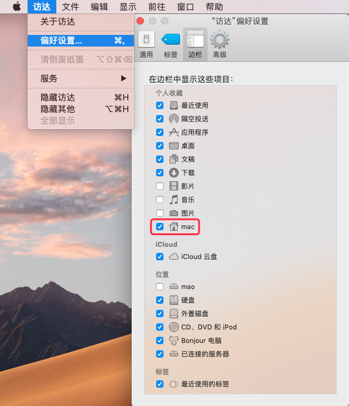

# Mac常用设置


## 目录

* [系统设置](#系统设置)
* [修饰键](#修饰键)
* [显示个人用户文件夹](#显示个人用户文件夹)
* [修改用户名和用户文件夹](#修改用户名和用户文件夹)
* [修改HostName](#修改HostName)
* [Sudo免密码设置](#Sudo免密码设置)
* [About](#About)
* [License](#License)


## 系统设置
   
   在任何的操作系统中，首先你需要做一件事就是更新系统，点击窗口左上角的  > 关于本机 > 软件更新。
   此外，如果这是一部新的电脑，你还需要到系统设置进行一些适当调整。如何调整，取决于个人喜好。
   
   * 触控板(系统设置 > 触控板)
     * [ ] 光标与点击
     * [x] 轻拍来点按
     * [x] 辅助点按
     * [x] 查找
     * [x] 三指拖移
     * [ ] 滚动缩放
     * [x] 默认全选
     * [ ] 更多手势
     * [x] 默认全选
   * Dock
     * 置于屏幕上的位置：底部
     * 设置Dock图标更小(大小随个人喜好)
     * ✓ 自动显示和隐藏Dock
   * Finder
     * Finder > 显示
     * Finder > 偏好设置
       * 通用:开启新Finder窗口时打开:HOME「用户名」目录
       * 边栏:添加HOME用户名」目录和创建代码文件目录,将共享的(shared)和标记(tags)目录去掉
   * 菜单栏
     * 去掉蓝牙等无需经常使用的图标
     * 将电池显示设置为百分比
   
   * Spotlight
     * 去掉字体和书签与历史记录等不需要的内容
     * 设置合适的快捷键
   
   * 互联网帐户
     * 添加iCloud用户，同步日历，联系人和 Find my mac 等等。


## 修饰键


## 显示个人用户文件夹

访达->偏好设置->边栏->用户名打勾。




## 修改用户名和用户文件夹

* 打开终端,输入`sudo su`回车
* 输入登录密码(必须有密码才能执行)
* 输入`cd /Users`回车
* 输入`mv mac work`回车,mac就是你原来的个人目录名称(短名称),work是你想修改的名称。

  > 注：短名称必须全部小写、无空格且只包含字母。
  
  这时你会发现在访达里没有桌面、下载等等文件夹了，不要慌，因为原来的个人目录名称被修改了，电脑无法识别了，开始下一步。

* 打开**系统偏好设置**的**用户与群组**面板，来创建一个具有上一步骤中所使用的帐户名称或短名称的新用户。
  当系统提示`"用户"文件夹中已经有名称为"帐户名称"的文件夹。您想将该文件夹用作此用户帐户的个人文件夹吗?`时，选择好。
  
  > 注：这将更正个人文件夹中所有文件的所有权，并避免文件夹内容出现权限问题。

* 注销电脑。以新创建用户的身份登录(提示钥匙串问题点击更新钥匙串)。现在应该能够访问(桌面上、文稿中及该个人目录下其他文件夹中的)所有原始文件。
* 验证您的数据是否正常后，可通过**用户与群组**面板删除原始用户帐户。

  > 如果你发现有些文件夹无法访问提示无权限，右键文件夹->显示简介->共享与权限，
    点击右下角小锁(密码应该是无，直接回车就可以了),点+号添加你改名的管理员账号，接着权限改成读与写即可。


## 修改HostName

打开终端，执行下面命令，"tmp"是你想要修改的计算机名。

```
sudo scutil --set HostName tmp
```

> 执行过后命令，需要强行退出终端，重新打开就好了。


## Sudo免密码设置

* 打开命令窗口输入如下命令：`sudo visudo`
* 替换 #%username ALL=(ALL) ALL 为:`%username ALL=(ALL) NOPASSWD: ALL`

> username为当前登录用户名


## About

* **作者**：March
* **邮箱**：fengqi.mao.march@gmail.com
* **头条**：https://toutiao.io/u/425956/subjects
* **简书**：https://www.jianshu.com/u/02f2491c607d
* **掘金**：https://juejin.im/user/5b484473e51d45199940e2ae
* **知乎**：http://zhihu.com/people/maofengqi
* **豆瓣**：https://www.douban.com/people/maofengqi/
* **CSDN**：http://blog.csdn.net/u011810138
* **Github**：https://github.com/maoqiqi
* **开源中国**：https://my.oschina.net/maoqiqi
* **喜马拉雅听书**：https://www.ximalaya.com/zhubo/31419312/
* **SegmentFault**：https://segmentfault.com/u/maoqiqi
* **StackOverFlow**：https://stackoverflow.com/users/8223522


## License

```
   Copyright 2019 maoqiqi

   Licensed under the Apache License, Version 2.0 (the "License");
   you may not use this file except in compliance with the License.
   You may obtain a copy of the License at

       http://www.apache.org/licenses/LICENSE-2.0

   Unless required by applicable law or agreed to in writing, software
   distributed under the License is distributed on an "AS IS" BASIS,
   WITHOUT WARRANTIES OR CONDITIONS OF ANY KIND, either express or implied.
   See the License for the specific language governing permissions and
   limitations under the License.
```