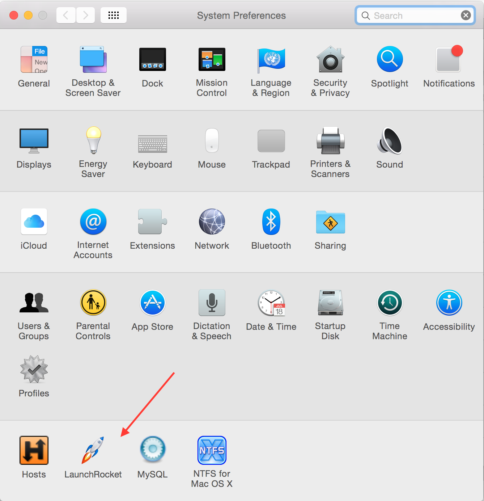
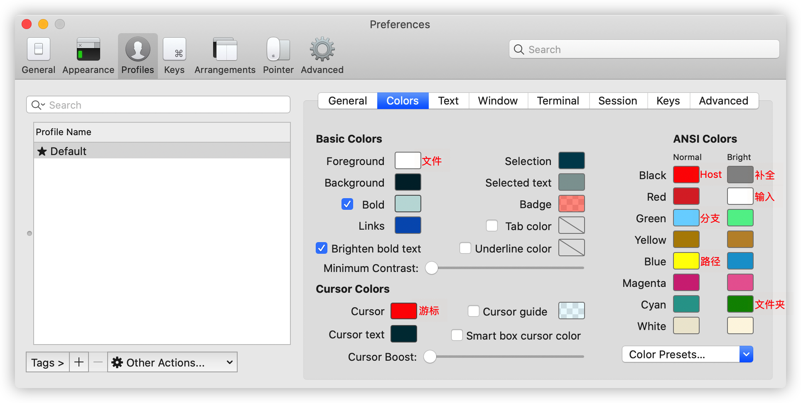

# Mac终端神器


## 目录

* [brew](#brew)
   * [安装](#安装)
      * [安装并更改源](#安装并更改源)
   * [基本使用](#基本使用)
   * [拓展Cask](#拓展cask)
* [iTerm2](#iterm2)
   * [常用快捷命令](#常用快捷命令)
* [oh-my-zsh](#oh-my-zsh)
   * [安装](#安装-1)
   * [卸载](#卸载)
   * [选择主题](#选择主题)
   * [安装配色方案](#安装配色方案)
      * [Solarized](#solarized)
      * [iTerm2-Color-Schemes](#iterm2-color-schemes)
      * [自定义配色方案](#自定义配色方案)
   * [安装代码高亮插件](#安装代码高亮插件)
   * [安装命令建议和补全插件](#安装命令建议和补全插件)
   * [背景设置](#背景设置)
      * [推荐背景图](#推荐背景图)
   * [其它设置](#其它设置)
* [终端神器快捷配置](#终端神器快捷配置)
   * [执行命令](#执行命令)
   * [编辑 ~/.zshrc 文件](#编辑-zshrc-文件)
   * [配置](#配置)
* [Donate](#donate)
* [About](#about)
* [License](#license)
      

## brew

Homebrew 是目前在 OS X 系统中最受欢迎的包管理工具。类似于 centos 下的 yum,可以很方便地进行安装、卸载、更新各种软件包。

### 安装

`/bin/bash -c "$(curl -fsSL https://raw.githubusercontent.com/Homebrew/install/master/install.sh)"`

#### 安装并更改源

在 Mac 上安装 brew 时,如果使用官方推荐的方式,会耗费很长时间,并且也不一定能成功。

将安装源换成国内源

* 将 brew 的 install 文件下载本地

  `curl -fsSL https://raw.githubusercontent.com/Homebrew/install/master/install >> brew_install`
  
* 修改 install 文件的镜像源

  `vim brew_install`
  
* 将 brew_install 文件里面的两行代码替换掉

  待替换的代码为：
  
  ```
  BREW_REPO = "https://github.com/Homebrew/brew".freeze
  CORE_TAP_REPO = "https://github.com/Homebrew/homebrew-core".freeze
  ```
  
  替换为：
  
  ```
  BREW_REPO = "git://mirrors.ustc.edu.cn/brew.git".freeze
  CORE_TAP_REPO = "git://mirrors.ustc.edu.cn/homebrew-core.git".freeze
  ```
  
  修改完成之后保存好修改后的brew_install文件。
  
* 安装

  `/usr/local/bin/ruby ~/brew_install`

### 基本使用

* `brew update`:更新 Homebrew 在服务器端上的包目录
* `brew install <package_name>`:安装
* `brew upgrade <package_name>`:更新
* `brew remove`:卸载
* `brew outdated`:查看你的包是否需要更新
* `brew cleanup`:Homebrew 将会把老版本的包缓存下来,以便当你想回滚至旧版本时使用。但这是比较少使用的情况,当你想清理旧版本的包缓存时,可以运行。
* `brew list`:列出当前安装的软件
* `brew list --versions`:列出当前安装的软件(包括版本号)
* `brew search <package_name>`:查询与`package_name`相关的可用软件
* `brew info <package_name>`:查询`package_name`的安装信息

### 拓展Cask

你已经感受到了使用 Homebrew 安装命令行程序的便利。那么接下来,我们将通过 Homebrew Cask 优雅、简单、快速的安装和管理 OS X 图形界面程序,比如 Google Chrome 和 Dropbox。

```
# 安装 brew-cask-completion
brew install brew-cask-completion
# 安装 google-chrome
brew cask install google-chrome
# 卸载 google-chrome
brew cask remove google-chrome
```

常用 OS X 图形界面程序

```
brew cask install alfred
brew cask install appcleaner
brew cask install cheatsheet
brew cask install dropbox
brew cask install google-chrome
brew cask install onepassword
brew cask install sublime-text
brew cask install totalfinder
```

> 如果你经常使用 Alfred 启动程序,那么你会想 Alfred 可以搜索 brew cask 安装的程序,实现这些仅需运行：

```
brew cask alfred link
```

此外你还可以通过 brew cask 安装 [launch rocket](https://github.com/jimbojsb/launchrocket) ,来管理通过brew安装的service。




## iTerm2

作为一名开发者,我们常常花上很多时间在终端上,如同武士的剑,一出手便知高低。所以让我们安装 Mac 上最强大的终端 iTerm2吧！

### 常用快捷命令

|命令|说明|
|:-----|:-----|
|`command + t`|新建标签|
|`command + w`|关闭标签|
|`command + 数字` `command + 左右方向键`|切换标签|
|`command + d`|垂直分屏|
|`command + shift + d`|水平分屏|
|`command + shift + h`|查看剪贴板历史|
|`ctrl + u`|清除当前行|
|`ctrl + w`|删除光标之前的单词|
|`ctrl + k`|删除到文本末尾|


## oh-my-zsh

zsh 的功能极其强大,只是配置过于复杂,通过 oh-my-zsh 可以很快配置 zsh 。

使用 brew 完成 zsh 和 zsh completions 的安装:`brew install zsh zsh-completions`

> * Mac系统默认使用 bash 作为终端,可以使用命令修改默认使用 zsh: `chsh -s /bin/zsh`
> * 如果想修改回默认 bash,同样使用 chsh 命令即可: `chsh -s /bin/bash`
> * 查看系统当前使用的 shell: `echo $SHELL`
> * 查看系统是否安装了 zsh: `cat /etc/shells`

### 安装

安装有 curl 和 wget 两种安装方式,看自己环境或喜好,详细查看[Install oh-my-zsh](https://ohmyz.sh/#install)。

### 卸载

输入命令: `uninstall_oh_my_zsh`

### 选择主题

oh-my-zsh 主题列表: https://github.com/robbyrussell/oh-my-zsh/wiki/themes

```
# 设置主题
ZSH_THEME="agnoster"
```

> 注意：许多主题需要安装 [Powerline Fonts](https://github.com/powerline/fonts) 才能正确呈现。
> ```
> # clone
> git clone https://github.com/powerline/fonts.git --depth=1
> # install
> cd fonts
> ./install.sh
> # clean-up a bit
> cd ..
> rm -rf fonts
> ```
> 
> 安装好字体库之后,我们来设置 iTerm2 的字体:
> 打开`iTerm2 -> Preferences -> Profiles -> Text`,在 Font 区域选中 Change Font ,然后找到 Meslo 字体。

### 安装配色方案

#### Solarized

```
cd ~/.oh-my-zsh/custom/plugins
git clone https://github.com/altercation/solarized
cd solarized/iterm2-colors-solarized/
open .
```

在打开的 finder 窗口中,双击`Solarized Dark.itermcolors`和`Solarized Light.itermcolors`即可安装明暗两种配色。

打开`iTerm2 -> Preferences -> Profiles -> Colors -> Color Presets`中根据个人喜好选择。

或者在`iTerm2 -> Preferences -> Profiles -> Colors -> Load Presets -> import`将其导入,然后选择该配色。

#### iTerm2-Color-Schemes

```
cd ~/.oh-my-zsh/custom/plugins
git clone https://github.com/mbadolato/iTerm2-Color-Schemes
cd iTerm2-Color-Schemes/schemes
```

使用方法同上把配色文件导入,然后选择该配色

#### 自定义配色方案



这是我的配色文件下载: [自定义配色方案 march](https://raw.githubusercontent.com/maoqiqi/all/master/mac/assert/march.itermcolors) 。

### 安装代码高亮插件

```
cd ~/.oh-my-zsh/custom/plugins
git clone https://github.com/zsh-users/zsh-syntax-highlighting
```

这时我们再次打开 zshrc 文件进行编辑。找到 plugins ,此时 plugins 中应该已经有了 git ,我们需要把高亮插件也加上。

```
plugins=(git zsh-syntax-highlighting)
```

> 请务必保证插件顺序,`zsh-syntax-highlighting`必须在最后一个。
> 执行命令使刚才的修改生效: `source ~/.zshrc`

### 安装命令建议和补全插件

跟代码高亮的安装方式一样,这也是一个插件,叫做`zsh-autosuggestion`,用于命令建议和补全。

```
cd ~/.oh-my-zsh/custom/plugins/
git clone https://github.com/zsh-users/zsh-autosuggestions
```

同上找到 plugins,把自动提示命令插件加上:

```
plugins=(git zsh-autosuggestions zsh-syntax-highlighting)
```

> 执行命令使刚才的修改生效: `source ~/.zshrc`

### 背景设置

在`iTerm2 -> Preferences -> Profiles -> Window -> Background Image`选择背景图片。

#### 推荐背景图

* https://github.com/maoqiqi/all/raw/master/mac/images/bg/1.jpg
  
  
  
* https://github.com/maoqiqi/all/raw/master/mac/images/bg/2.jpeg
  
  
  
* https://github.com/maoqiqi/all/raw/master/mac/images/bg/3.jpg
  
  
  
* https://github.com/maoqiqi/all/raw/master/mac/images/bg/4.png
  
  

* https://github.com/maoqiqi/all/raw/master/mac/images/bg/5.jpg
  
  

### 其它设置

```
# 设置别名
alias zshconfig="vim ~/.zshrc"
alias envconfig="vim ~/.env"
alias ohmyzsh="vim ~/.oh-my-zsh"  

# 隐藏用户名和主机名(user@hostname)
prompt_context() {}

# 只显示用户名
prompt_context() {
  if [[ "$USER" != "$DEFAULT_USER" || -n "$SSH_CLIENT" ]]; then
    prompt_segment black default "%(!.%.)$USER"
  fi
}
```

> 其它配置最好配置在自定义文件中,比如 .env 文件,用于维护别名(aliases),输出(exports)和路径改变(path changes)等等,以免影响 ~/.zshrc 。


## 终端神器快捷配置

oh-my-zsh 安装完成之后,执行以下操作

### 执行命令

```
cd ~/.oh-my-zsh/custom/plugins
git clone https://github.com/powerline/fonts.git --depth=1
cd fonts && ./install.sh
cd .. && rm -rf fonts
git clone https://github.com/altercation/solarized
git clone https://github.com/mbadolato/iTerm2-Color-Schemes
git clone https://github.com/zsh-users/zsh-syntax-highlighting
git clone https://github.com/zsh-users/zsh-autosuggestions
```

### 编辑 ~/.zshrc 文件

```
ZSH_THEME="agnoster"

plugins=(git zsh-autosuggestions zsh-syntax-highlighting)
```

### 配置

在`iTerm2 -> Preferences -> Profiles -> Colors -> Load Presets -> import`导入配色,然后选择该配色。

然后执行[背景设置](#背景设置),下面就是效果了。


> [作者自定义配色方案下载](https://raw.githubusercontent.com/maoqiqi/all/master/mac/assert/march.itermcolors)
> [作者推荐背景图下载](#推荐背景图)


## Donate

感谢您的耐心阅读,如果您发现文章中有一些没表述清楚的,或者是不对的地方,请给我留言,你的鼓励是作者写作最大的动力。

如果您认为本文质量不错,读后觉得收获很大,不妨小额赞助我一下,让我更有动力继续写出高质量的文章。


## About

* **作者**：March
* **邮箱**：fengqi.mao.march@gmail.com
* **码云**：https://gitee.com/maofengqi
* **知乎**：http://zhihu.com/people/maofengqi
* **头条**：https://toutiao.io/u/425956/subjects
* **简书**：https://www.jianshu.com/u/02f2491c607d
* **掘金**：https://juejin.im/user/5b484473e51d45199940e2ae
* **豆瓣**：https://www.douban.com/people/maofengqi/
* **CSDN**：http://blog.csdn.net/u011810138
* **InfoQ**: https://www.infoq.cn/profile/1625261
* **Github**：https://github.com/maoqiqi
* **开源中国**：https://my.oschina.net/maoqiqi
* **Twitter**：https://twitter.com/maofengqi
* **Facebook**：https://www.facebook.com/fengqi.mao
* **喜马拉雅听书**：https://www.ximalaya.com/zhubo/31419312/
* **SegmentFault**：https://segmentfault.com/u/maoqiqi
* **StackOverFlow**：https://stackoverflow.com/users/8223522

> 著作权归作者所有。商业转载请联系作者获得授权，非商业转载请注明出处。


## License

```
   Copyright 2020 March

   Licensed under the Apache License, Version 2.0 (the "License");
   you may not use this file except in compliance with the License.
   You may obtain a copy of the License at

       http://www.apache.org/licenses/LICENSE-2.0

   Unless required by applicable law or agreed to in writing, software
   distributed under the License is distributed on an "AS IS" BASIS,
   WITHOUT WARRANTIES OR CONDITIONS OF ANY KIND, either express or implied.
   See the License for the specific language governing permissions and
   limitations under the License.
```